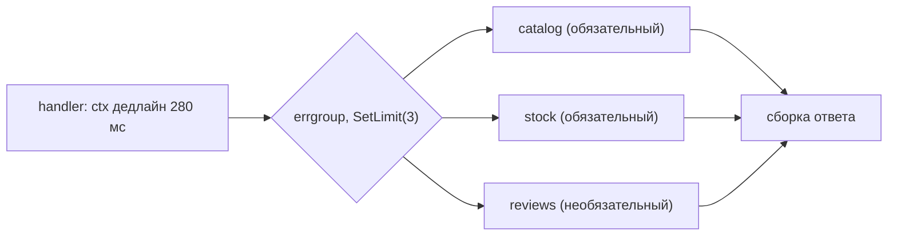

# Урок 02 — Fan-out через `errgroup`: контекст, лимит, частичные отказы

Задача-легенда: эндпоинт `GET /product/{id}` должен вернуть карточку товара. Данные лежат в
трёх местах: `catalog` (название, цена — **обязательно**), `stock` (наличие — **обязательно**),
`reviews` (рейтинг — **необязательно**, можно без него). SLA эндпоинта — 300 мс на p99.

Это самый частый Go-вопрос на архитектурном интервью, поэтому разберём его до костей.

## Шаг 1. Считаем, зачем вообще параллелить

Последовательно: 80 + 60 + 120 = **260 мс**, и это в хорошую погоду; на p99 каждый вызов
вдвое дольше и мы вылетаем из SLA. Параллельно: `max(80, 60, 120)` = **120 мс**. Разница не
косметическая, а «проходим/не проходим».



## Шаг 2. Наивный вариант и его проблемы

```go
var wg sync.WaitGroup
wg.Add(3)
go func() { defer wg.Done(); cat, _ = catalog.Get(ctx, id) }()   // ошибки проглочены
go func() { defer wg.Done(); st, _ = stock.Get(ctx, id) }()
go func() { defer wg.Done(); rv, _ = reviews.Get(ctx, id) }()
wg.Wait()
```

Что здесь плохо: ошибки теряются; при провале `catalog` мы всё равно ждём остальных; нет
общего дедлайна; при веере из 300 элементов будет 300 горутин и 300 сокетов; запись в
переменные из разных горутин без синхронизации — это гонка (её увидит `-race`, но не
компилятор).

## Шаг 3. Правильный fan-out

```go
func (a *App) productCard(ctx context.Context, id int64) (Card, error) {
    // Бюджет вниз меньше нашего SLA: остаётся время на сборку ответа и сериализацию.
    ctx, cancel := context.WithTimeout(ctx, 250*time.Millisecond)
    defer cancel()

    g, ctx := errgroup.WithContext(ctx) // первая ошибка отменит ctx у остальных
    var (
        cat Catalog
        st  Stock
        rv  Reviews
    )
    g.Go(func() (err error) { cat, err = a.catalog.Get(ctx, id); return err })
    g.Go(func() (err error) { st, err = a.stock.Get(ctx, id); return err })
    g.Go(func() error {
        // Необязательная зависимость: её ошибка не должна валить весь ответ,
        // поэтому наружу возвращаем nil, а факт деградации фиксируем метрикой.
        r, err := a.reviews.Get(ctx, id)
        if err != nil {
            a.metrics.Degraded("reviews")
            return nil
        }
        rv = r
        return nil
    })
    if err := g.Wait(); err != nil { // Wait ждёт всех: горутины не переживут функцию
        return Card{}, err
    }
    return Card{Catalog: cat, Stock: st, Reviews: rv}, nil
}
```

Четыре решения, которые надо озвучить вслух:

1. **Отдельный дедлайн вниз** (250 мс при SLA 300 мс) — запас на сборку и на сериализацию.
2. **`errgroup.WithContext`** — при ошибке обязательного вызова остальные получают
   `ctx.Done()` и не жгут ресурсы зря.
3. **Необязательная зависимость возвращает `nil`** и учитывается метрикой «деградация».
   Это и есть graceful degradation в коде: карточка без рейтинга лучше, чем 500.
4. **`g.Wait()` до выхода из функции** — гарантия отсутствия утечки горутин. Каждая
   переменная пишется ровно одной горутиной и читается после `Wait()`, поэтому гонки нет.

```drill
type: multiple-choice
prompt: "Что даёт errgroup.WithContext по сравнению с sync.WaitGroup в fan-out?"
options: ["Ускоряет вызовы", "Возвращает первую ошибку и отменяет контекст остальных горутин", "Автоматически ретраит упавшие вызовы", "Ограничивает память"]
answer: "Возвращает первую ошибку и отменяет контекст остальных горутин"
check: exact
```

## Шаг 4. Когда веер широкий

Теперь корзина: нужно получить 300 товаров. Три горутины превратились в 300 — а это 300
сокетов к `catalog` и 300 буферов. `SetLimit` превращает веер в конвейер:

```go
g, ctx := errgroup.WithContext(ctx)
g.SetLimit(16) // потолок = что выдержит сосед и наш пул соединений, а не «сколько элементов»
res := make([]Item, len(ids))
for i, id := range ids {
    i, id := i, id
    g.Go(func() error {
        item, err := a.catalog.Get(ctx, id)
        if err != nil {
            return err
        }
        res[i] = item // каждая горутина пишет в свой индекс — синхронизация не нужна
        return nil
    })
}
if err := g.Wait(); err != nil {
    return nil, err
}
```

И сразу вопрос, который любит интервьюер: **а не лучше ли один batch-запрос?** Лучше. 300
вызовов по 5 мс с лимитом 16 — это ~19 волн × 5 мс ≈ 95 мс плюс 300 раз накладные расходы на
запрос; один `GET /products?ids=...` — 15–20 мс. Правильный ответ звучит так: «сначала прошу у
владельца данных batch-эндпоинт (или `IN (...)` в репозитории); `errgroup` с лимитом — это
решение, когда batch недоступен».

## Шаг 5. Частичный отказ: три политики

| Политика | Когда | Как выглядит |
|---|---|---|
| **Fail fast** | все зависимости обязательны | первая ошибка → отмена остальных → 5xx/4xx клиенту |
| **Graceful degradation** | часть данных необязательна | ошибку глотаем, помечаем метрикой, отдаём частичный ответ и (полезно) флаг `partial: true` |
| **Best effort с порогом** | список из N элементов | собираем ошибки через `errors.Join`, отдаём успешные; если провалилось больше X% — считаем запрос неуспешным |

Что ещё стоит сказать, чтобы ответ звучал зрело:

- **Таймаут на каждый вызов, не только общий.** Общий дедлайн защищает клиента, но медленный
  сосед всё равно съест весь бюджет; свой таймаут на вызов даёт шанс на fallback.
- **Retry — осторожно.** Ретраить внутри веера означает умножать нагрузку на уже страдающего
  соседа. Максимум один повтор, с jitter, только для идемпотентных вызовов и только если в
  бюджете осталось время.
- **Circuit breaker** перед часто падающим соседом: не тратить бюджет на вызов, который
  почти наверняка не ответит (см. [`../06-scalability-and-reliability/theory.md`](../../06-scalability-and-reliability/theory.md)).
- **Кэш и `singleflight`** для «обязательного, но редко меняющегося» — тогда отказ `catalog`
  не всегда виден пользователю.

```drill
type: free-form
prompt: "Проговори вслух ответ на вопрос «ваш handler делает три вызова вниз — как вы их запустите?» так, чтобы закрыть латентность, отмену, лимит и частичный отказ."
answer: "Параллельно через errgroup.WithContext: латентность = максимум из трёх, а не сумма. Дедлайн беру из контекста запроса и уменьшаю (например 250 мс при SLA 300), чтобы остался запас на сборку ответа; у каждого клиента ещё и свой таймаут. Обязательные зависимости возвращают ошибку — errgroup отменяет контекст остальных, чтобы не жечь ресурсы, и g.Wait() гарантирует, что горутины не переживут запрос. Необязательную зависимость деградирую: ошибку не пробрасываю, ставлю метрику и отдаю ответ без этого блока, при желении с флагом partial. Если веер широкий — SetLimit по узкому месту (пул БД или лимит соседа), но сначала спрошу batch-эндпоинт: один запрос дешевле трёхсот. Retry максимум один, с jitter, только для идемпотентных вызовов и только если в бюджете есть время; перед проблемным соседом — circuit breaker."
check: manual
```

## Итог

Каркас ответа на «сделай три вызова»: **параллельно → общий уменьшенный дедлайн → таймаут на
вызов → отмена по первой ошибке → лимит при широком веере → политика частичного отказа →
batch, если он возможен**. И два технических факта, которые надо помнить дословно:
`errgroup.WithContext` отменяет остальных по первой ошибке, а `Wait()` — это ещё и гарантия
отсутствия утечки горутин.
