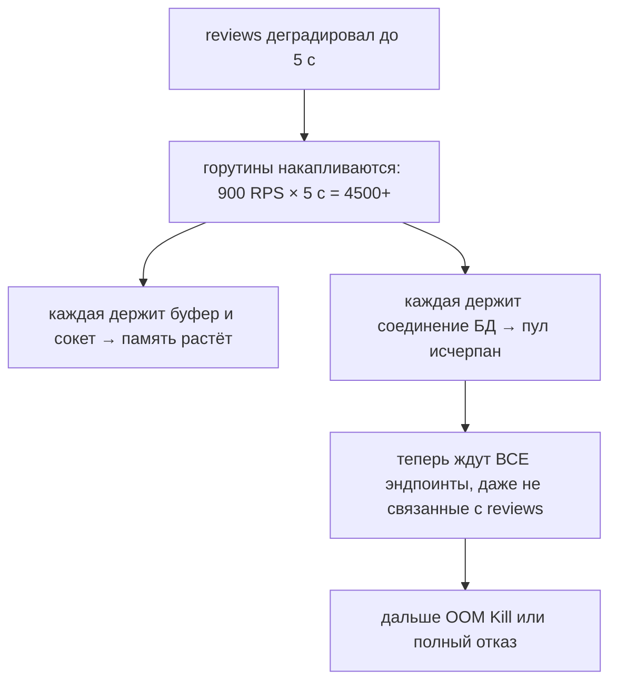

# Урок 03 — Разбор инцидента: медленный и текущий сервис под pprof

Это урок-нарратив. Читай его как расшифровку реального инцидента: на интервью такой рассказ
ценится выше, чем перечисление флагов `go tool pprof`, потому что показывает **метод**.

## 21:40 — симптом

Приходит алерт: p99 эндпоинта `GET /product/{id}` вырос с 120 мс до 1.8 с. RPS при этом
**не изменился** — 900. Память процесса растёт линейно: 900 МБ, час назад было 400. Ошибок 5xx
пока мало — 0.3%.

Первое, что делает сильный инженер, — **не идёт в код**. Он смотрит на форму графиков:

- RPS не вырос → это не нагрузка;
- память растёт монотонно, без плато → это накопление, а не пик;
- latency выросла у одного эндпоинта, не у всех → подозрение на одну зависимость;
- 5xx почти нет → значит запросы **успешно** медленные, то есть мы ждём.

Гипотеза №1: мы ждём кого-то внизу, и ожидающие запросы накапливаются в памяти.

## 21:45 — дешёвая проверка: горутины

```bash
curl -s "http://10.0.3.17:6060/debug/pprof/goroutine?debug=1" | head -40
```

Вывод (сокращённо):

```text
goroutine profile: total 41 233
23 901 @ 0x43e1c5 0x44b8f9 0x6f21aa 0x6f30b1 ...
#   net/http.(*persistConn).roundTrip
#   myapp/internal/client/reviews.(*Client).Get
#   myapp/internal/product.(*Service).card.func3

11 402 @ ...
#   database/sql.(*DB).conn
#   myapp/internal/storage/postgres.(*Repo).ByID
```

Это диагноз почти целиком. 41 тысяча горутин при 900 RPS — значит одновременно живёт ~45
секунд работы. Два стека:

1. **23 901 горутина ждёт ответа от `reviews`.** Клиент `reviews` висит в `roundTrip` — то
   есть у него **нет таймаута** (или таймаут огромный).
2. **11 402 горутины стоят в `database/sql.(*DB).conn`** — ждут соединение из пула. Пул забит,
   потому что каждая горутина берёт соединение **до** вызова `reviews` и держит его всё время
   ожидания.

Формула инцидента: медленный сосед → горутины накапливаются → они держат соединения БД →
любые другие запросы тоже начинают ждать пул → «медленно всё».



## 21:52 — подтверждаем память

Снимаем два heap-профиля с интервалом 5 минут и сравниваем:

```bash
curl -s "http://10.0.3.17:6060/debug/pprof/heap" > h1.pb.gz
# ... через 5 минут ...
curl -s "http://10.0.3.17:6060/debug/pprof/heap" > h2.pb.gz
go tool pprof -base h1.pb.gz h2.pb.gz     # смотрим ПРИРОСТ, а не абсолют
(pprof) top10 -cum
```

Сверху — `bytes.(*Buffer).grow` под `io.ReadAll` в клиенте `reviews`: каждая висящая горутина
держит частично прочитанный ответ. 24 000 × ~30 КБ ≈ 700 МБ. Совпадает с наблюдаемым ростом.

Важная деталь метода: **`inuse_space` с базой** отвечает на «кто накапливает», а не «кто много
аллоцировал за всё время» (это `alloc_space`). Путать их — самая частая ошибка чтения
heap-профиля.

```drill
type: multiple-choice
prompt: "Память растёт, надо найти, кто её накапливает. Какой профиль и как смотреть?"
options: ["CPU profile, top10", "heap, alloc_space без базы", "два heap-снимка с интервалом и diff по inuse_space (go tool pprof -base)", "block profile"]
answer: "два heap-снимка с интервалом и diff по inuse_space (go tool pprof -base)"
check: exact
hint: Абсолютный профиль без базы почти ничего не говорит про накопление.
```

## 22:05 — тушим

Быстрые действия (mitigation), в порядке уменьшения риска:

1. **Отключить `reviews` фича-флагом.** Блок необязательный — карточка отдаётся без рейтинга.
   Через минуту p99 = 140 мс, память перестаёт расти. Это и есть смысл feature flag'ов и
   graceful degradation.
2. Перезапустить pod'ы с накопленной памятью (после того как источник перестал наливать).
3. Только потом разбираться, что случилось у `reviews`.

Что **не** надо делать в этот момент: поднимать лимит памяти пода (отложит OOM на час),
увеличивать `MaxOpenConns` (перенесёт перегрузку в БД), добавлять реплики (умножит нагрузку на
уже страдающего соседа).

## 22:40 — исправляем по-настоящему

Четыре правки, каждую надо уметь назвать на интервью:

```go
// 1) Таймаут у клиента соседа — меньше нашего SLA. Отсутствие таймаута = отсутствие границы.
reviewsClient := &http.Client{Timeout: 300 * time.Millisecond, Transport: sharedTransport}

// 2) Соединение к БД берём ПОСЛЕ сетевого вызова, а не удерживаем во время ожидания.
rv := a.reviews.GetOrEmpty(ctx, id)  // сеть
row := a.db.QueryRowContext(ctx, ... ) // только теперь занимаем слот пула

// 3) Потолок одновременных вызовов к необязательному соседу + отказ вместо очереди.
if !a.reviewsSem.TryAcquire(1) {
    a.metrics.Degraded("reviews_shed")
    return emptyReviews // load shedding: лучше без рейтинга, чем весь сервис в ожидании
}
defer a.reviewsSem.Release(1)

// 4) Circuit breaker: после порога ошибок перестаём звонить вовсе на 30 секунд.
```

Плюс наблюдаемость, чтобы в следующий раз алерт пришёл раньше симптома:

- метрика `go_goroutines` с алертом на **монотонный рост** (не на абсолютное значение);
- гистограмма latency **по каждой исходящей зависимости** отдельно;
- метрика ожидания в пуле БД (`sql.DBStats.WaitCount`, `WaitDuration`);
- `GOMEMLIMIT` ~80% лимита пода — чтобы GC поджался раньше, чем cgroups пришлёт SIGKILL.

## Шпаргалка «симптом → профиль → вывод»

| Симптом | Что снять | Что увидишь и что делать |
|---|---|---|
| Память растёт монотонно | 2× heap, diff по `inuse_space` | кто накапливает: висящие горутины, безлимитный кэш, буферы |
| Горутин десятки тысяч | `goroutine?debug=1` | общий стек = точка утечки/ожидания: нет таймаута, нет `ctx.Done()` |
| CPU 100%, RPS не растёт | CPU profile 30 с | бизнес-функция → оптимизировать; `runtime.mallocgc` сверху → давление аллокаций |
| Всё «ждёт», CPU низкий | block + mutex, trace | ожидание пула БД, глобальный мьютекс, медленный сосед |
| p99 рваный, p50 в норме | trace, GC-метрики, GOMAXPROCS | GC на фоне аллокаций или GOMAXPROCS не по квоте контейнера |

```drill
type: free-form
prompt: "Интервьюер: «Сервис под нагрузкой съел 8 ГБ и получил OOM Kill. Куда смотришь?» Расскажи вслух по шагам."
answer: "Сначала метрики, не код: растёт память монотонно или скачком, менялся ли RPS, растёт ли NumGoroutine, у какого эндпоинта выросла latency. Если горутины растут — goroutine-профиль: тысячи горутин в одном стеке показывают точку ожидания или утечки (нет таймаута у клиента, нет case ctx.Done(), не закрыт resp.Body). Затем два heap-профиля с интервалом и diff по inuse_space: типичные виновники — висящие запросы с буферами, безлимитный in-memory кэш, чтение всего тела ответа в память. Параллельно проверяю границы: таймауты исходящих вызовов, MaxOpenConns и ожидание в пуле, MaxConnsPerHost, лимит тела запроса, потолок параллельности. Тушение — деградировать или отключить необязательную зависимость флагом и перезапустить pod'ы; лечение — таймауты меньше SLA, семафор с load shedding, circuit breaker, соединение к БД брать после сетевого вызова. GOMEMLIMIT ~80% лимита пода как страховка, но это симптоматика, а не причина. И добавить алерт на монотонный рост горутин, чтобы в следующий раз узнать раньше пользователей."
check: manual
```

## Итог

Метод важнее команд: **симптом → форма графиков → дешёвый профиль (goroutine) → heap с базой →
границы (таймауты, пулы, лимиты) → тушение деградацией → исправление и алерты**. Инцидент этого
урока — канонический: у одного исходящего клиента не было таймаута, соединение к БД
удерживалось во время ожидания, и медленный необязательный сосед положил весь сервис. Три
строки настроек стоили бы дешевле, чем один такой вечер.
