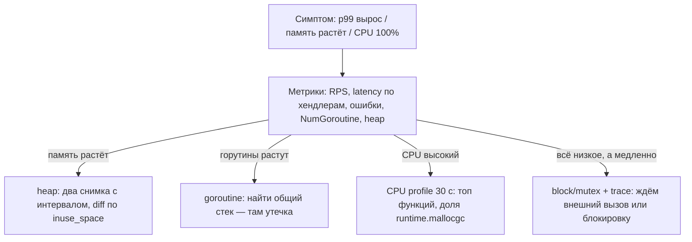

# Runtime и диагностика: пакеты, GC, планировщик, pprof

Первая часть модуля ([`theory.md`](./theory.md)) — про то, как сервис устроен. Эта — про то,
как он **ведёт себя под нагрузкой** и как это доказать цифрами, а не ощущениями.

## Четыре пакета, которые стоит называть по имени

### `singleflight` — один поход вместо тысячи

**Простыми словами:** если тысяча запросов одновременно просят один и тот же
отсутствующий в кэше ключ, наивный код сделает тысячу одинаковых запросов в БД. `singleflight`
пропускает **один**, а остальным отдаёт его результат.

```go
var g singleflight.Group

func GetUser(ctx context.Context, id int64) (User, error) {
    key := strconv.FormatInt(id, 10)
    // Do схлопывает конкурентные вызовы с одинаковым ключом в один реальный вызов.
    v, err, _ := g.Do(key, func() (any, error) { return loadFromDB(ctx, id) })
    if err != nil {
        return User{}, err
    }
    return v.(User), nil
}
```

Это лекарство от **cache stampede** (см. [`../04-caching/theory.md`](../04-caching/theory.md)),
и на интервью это отличный конкретный ответ на «как защитить БД при истечении TTL горячего
ключа». Две оговорки, которые показывают глубину: схлопывание работает **внутри одного
процесса** (для кластера нужен распределённый lock или probabilistic early expiration), и
`ctx` первого вызывающего влияет на всех — при отмене лучше использовать `DoChan` с
`select` по своему контексту.

### `x/time/rate` — token bucket в стандартном виде

`rate.Limiter` — реализация token bucket: `rate.NewLimiter(100, 200)` — 100 событий в секунду
со всплеском до 200. Методы: `Allow()` (не ждать, отказать), `Wait(ctx)` (ждать в пределах
дедлайна), `Reserve()` (узнать, сколько ждать). Это локальный лимитер **на процесс**: при 10
pod'ах общий лимит умножается на 10. Общий лимит на пользователя — только через Redis
(см. [`../06-scalability-and-reliability/theory.md`](../06-scalability-and-reliability/theory.md)
и урок про rate limiter в модуле 10). Отдельная важная роль — **исходящий** лимит: не долбить
чужое API сверх его квоты.

### `sync.Pool` — переиспользование временных объектов

**Простыми словами:** мешок с заранее выделенными буферами, из которого можно взять и в
который принято вернуть. Снижает не столько «аллокации» в вакууме, сколько **давление на GC** в
горячем пути (JSON-энкодинг, склейка ответов).

```go
var bufPool = sync.Pool{New: func() any { return new(bytes.Buffer) }}

func render(w io.Writer, v any) error {
    b := bufPool.Get().(*bytes.Buffer)
    b.Reset()                  // содержимое чужое, обязательно чистим
    defer bufPool.Put(b)       // возвращаем, иначе смысла нет
    ...
}
```

Честные ограничения: пул очищается на каждом цикле GC, объекты не «выделены навсегда»;
класть туда большие буферы неограниченного размера опасно (память запомнит худший случай);
и применять его стоит только после профиля, показавшего аллокации, а не «на всякий случай».

### In-memory кэш и границы памяти

Локальная `map` под мьютексом или библиотека вроде `lru` — быстрее Redis на два порядка (нет
сети), но: (1) у каждого pod'а своя копия — инвалидация не мгновенная, (2) кэш **обязан быть
ограничен** по числу элементов или по байтам. Кэш без потолка — это утечка памяти с приятным
названием. Стандартный ответ на интервью: локальный кэш на редко меняющиеся справочники с
коротким TTL плюс Redis как общий слой; для больших локальных кэшей помнить, что они увеличивают
живой heap и, значит, работу GC.

## GC и латентность

**Простыми словами:** Go использует конкурентный mark-and-sweep сборщик. Он почти не
останавливает мир (паузы измеряются десятками-сотнями микросекунд), но **работает
параллельно с тобой и ест твой CPU**. Поэтому «GC-проблема» в Go редко выглядит как долгая
пауза, а обычно выглядит как «p99 подрос и CPU вырос на 25%».

Что реально влияет:

- **Скорость аллокаций (allocation rate).** Чем больше мусора в секунду, тем чаще циклы GC.
  Главные источники в вебе: сериализация/десериализация, конкатенация строк, интерфейсы и
  боксинг, слайсы без `make(..., 0, n)`, лишние копии в hot path.
- **Размер живого heap.** GC запускается, когда heap вырос на GOGC процентов относительно
  живого. Большой живой heap (толстый локальный кэш) = больше работы на каждый цикл маркировки.

Две ручки:

| Ручка | Смысл | Когда крутить |
|---|---|---|
| `GOGC` (по умолчанию 100) | новый цикл, когда heap вырос на 100% от живого | 200–400 снижает частоту GC ценой памяти; `off` — только для батчей |
| `GOMEMLIMIT` | мягкий потолок памяти: GC работает агрессивнее, приближаясь к нему | **обязателен в контейнере**: ставим ~80% лимита пода, чтобы GC поджался вместо OOM Kill |

Связка, которую стоит произнести на интервью: «в контейнере ставлю `GOMEMLIMIT` чуть ниже
memory limit'а пода — тогда при росте heap сборщик начнёт работать чаще и удержит процесс, а
не получит SIGKILL от cgroups. Если при этом CPU улетает в GC — значит проблема не в ручках, а
в аллокациях, и я иду в heap-профиль».

Когда GC вообще не стоит трогать: пока p99 в бюджете. Тюнинг GOGC без профиля — способ обменять
память на ничего.

## Планировщик, GOMAXPROCS и контейнеры

**Простыми словами:** `GOMAXPROCS` — сколько горутин могут выполнять Go-код одновременно.
Классическая ловушка: в контейнере с CPU-квотой 500m (пол-ядра) на хосте с 64 ядрами старые
версии Go выставляли `GOMAXPROCS = 64`. Рантайм считает, что у него 64 процессора, создаёт 64
рабочих потока, планировщик и GC раскладывают работу на все, а cgroups душит процесс квотой —
результат — рваная латентность и лишние переключения контекста. Исторический рецепт —
`automaxprocs` от Uber, который выставляет `GOMAXPROCS` по квоте cgroups; современные версии Go
учитывают CPU-лимит контейнера сами. Проверяемый вывод для интервью: **`GOMAXPROCS` должен
соответствовать реальной квоте контейнера**, и это стоит явно проверить, а не предполагать.

Ещё две вещи про планировщик:

- **Блокирующие системные вызовы** (файлы, `cgo`, DNS через системный резолвер) не блокируют
  планировщик целиком: горутина уезжает вместе с потоком, а рантайм заводит новый поток. Но
  если таких вызовов много и они долгие, растёт число потоков ОС — видно в
  `runtime/metrics` и в `/debug/pprof/threadcreate`.
- **`runtime.Gosched()` и «жёсткие» циклы**: чистый CPU-цикл без вызовов функций раньше мог не
  вытесняться; современный Go вытесняет асинхронно, так что это уже не типичная проблема, но
  длинный CPU-bound кусок в handler'е всё равно портит хвост латентности другим запросам.

## pprof: что смотреть под нагрузкой

**Простыми словами:** pprof — это сэмплирующий профайлер, встроенный в рантайм. Подключается
одной строкой и отвечает на вопрос «куда ушло время/память», а не «мне кажется, тормозит БД».

```go
// В проде — на отдельном порту, доступном только изнутри кластера, не на публичном.
import _ "net/http/pprof" // регистрирует хендлеры на DefaultServeMux

go func() { log.Println(http.ListenAndServe("127.0.0.1:6060", nil)) }()
```

| Профиль | Команда | Отвечает на вопрос | Красный флаг |
|---|---|---|---|
| CPU | `go tool pprof http://.../debug/pprof/profile?seconds=30` | куда уходит процессор | одна функция даёт 40%+; много времени в `runtime.mallocgc`/GC; регулярка или JSON в hot path |
| Heap | `.../debug/pprof/heap` | кто держит память **сейчас** (inuse) и кто аллоцировал всего (alloc) | растёт `inuse_space` у одной структуры между двумя снимками |
| Goroutine | `.../debug/pprof/goroutine?debug=1` | сколько горутин и **где они стоят** | тысячи горутин в одном стеке — почти всегда утечка |
| Block | `.../debug/pprof/block` (нужен `SetBlockProfileRate`) | где ждут на каналах/мьютексах | ожидание на семафоре пула БД |
| Mutex | `.../debug/pprof/mutex` (нужен `SetMutexProfileFraction`) | конкуренция за блокировки | один глобальный мьютекс кэша душит все ядра |
| Trace | `.../debug/pprof/trace?seconds=5` | что делали планировщик и GC во времени | длинные периоды без работы, ожидание сети |

Метод, а не тыканье:



Важное правило чтения heap-профиля: **`inuse_space` отвечает на «кто держит память», а
`alloc_space` — на «кто её создаёт»**. Утечку ищут по первому, давление на GC — по второму.
И всегда сравнивают два снимка во времени: абсолютный профиль без базы почти ничего не значит.

## Типичные вопросы интервью и сильные ответы

**«Handler делает три downstream-вызова. Как их запустишь?»**
Параллельно через `errgroup.WithContext` с общим дедлайном из запроса; латентность = максимум,
а не сумма; первая ошибка отменяет остальных; для необязательного вызова (рекомендации) —
деградация вместо 500. При большом веере — `SetLimit`. Если вызовы зависимы (второй нужен
результат первого) — честно сказать, что параллелить нечего, и сократить количество хопов.

**«Сколько горутин — это много?»**
Смотрю не на число, а на ресурс за горутиной: соединения к БД, сокеты, буферы. Потолок беру от
узкого места. Опасный признак — монотонный рост `NumGoroutine` при постоянном RPS: это утечка,
её видно в goroutine-профиле по общему стеку.

**«Сервис под нагрузкой ест 8 ГБ и получает OOM Kill. Куда смотришь?»**
По шагам: (1) метрики — растёт ли память монотонно или скачком; растёт ли `NumGoroutine`;
(2) goroutine-профиль — если тысячи горутин в одном стеке, это утечка (ждём в канале, нет
`ctx.Done()`, не закрыты `resp.Body`); (3) два heap-профиля с интервалом 10 минут, diff по
`inuse_space` — кто накапливает; типичные виновники: безлимитный in-memory кэш, буферы под
большие ответы, сохранение всего тела ответа в память; (4) проверяю лимиты: `MaxOpenConns`,
`MaxConnsPerHost`, потолок параллельности, `http.MaxBytesReader` на теле запроса;
(5) ставлю `GOMEMLIMIT` ~80% лимита пода как страховку — но это лечение симптома, а не
причины.

**«CPU 100%, а RPS не растёт. Что делаешь?»**
CPU-профиль на 30 секунд. Если сверху `runtime.mallocgc` и GC — проблема в аллокациях: смотрю
`alloc_space`, убираю лишние копии, преаллоцирую слайсы, кеширую сериализацию, при
необходимости — `sync.Pool`. Если сверху бизнес-функция — оптимизирую её или выношу в фон.
Если CPU высок, а профиль «размазан» — проверяю GOMAXPROCS против квоты контейнера.

**«Ваш сосед деградировал до 5 секунд. Что произойдёт с вашим сервисом?»**
Без лимитов — рост горутин и памяти, забитый пул БД, каскад. С лимитами — таймаут (меньше
нашего SLA), ограниченная параллельность, circuit breaker после порога ошибок, деградация
ответа или 503 с `Retry-After`. Плюс: соединение к БД брать **после** сетевого вызова, а не
удерживать во время него.

## Типичные ошибки и заблуждения

- **«В Go GC останавливает мир надолго».** Паузы малы; проблема обычно в потреблении CPU
  сборщиком из-за высокой скорости аллокаций.
- **«Покрутим GOGC — станет быстрее».** Без профиля это обмен памяти на ничего. Сначала
  измерение.
- **«`GOMEMLIMIT` не нужен, есть лимит пода».** Лимит пода даёт OOM Kill; `GOMEMLIMIT` даёт
  сборщику шанс поджаться раньше.
- **«`sync.Pool` ускорит любой код».** Он помогает в горячем пути с крупными временными
  объектами и только после профиля; в холодном коде — усложнение.
- **«`singleflight` защищает кластер».** Он схлопывает вызовы внутри процесса; 20 pod'ов дадут
  20 походов в БД.
- **«`x/time/rate` даёт глобальный лимит».** Локальный, на процесс; глобальный — только через
  общее хранилище.
- **«pprof в проде опасен».** CPU-профиль стоит несколько процентов на время сбора; heap и
  goroutine почти бесплатны. Опасно **публиковать** pprof наружу, а не пользоваться им.
- **«Профилировать надо на ноутбуке».** Профиль снимают там, где болит: с нагруженного
  инстанса, желательно во время инцидента или под нагрузочным тестом.

## Глоссарий

- **`singleflight`** — схлопывание одинаковых конкурентных вызовов в один (защита от stampede).
- **`rate.Limiter`** — token bucket из `x/time/rate`; локальный, на процесс.
- **`sync.Pool`** — переиспользование временных объектов, снижает давление на GC.
- **Allocation rate** — скорость создания мусора; главный драйвер частоты циклов GC.
- **GOGC** — процент прироста heap до следующего цикла GC (по умолчанию 100).
- **GOMEMLIMIT** — мягкий лимит памяти рантайма; заставляет GC работать агрессивнее у потолка.
- **GOMAXPROCS** — число одновременно исполняющих Go-код процессоров; должно соответствовать
  CPU-квоте контейнера.
- **pprof** — сэмплирующий профайлер: CPU, heap, goroutine, block, mutex, trace.
- **inuse_space / alloc_space** — память, удерживаемая сейчас / выделенная за всё время.

## См. также

- Go docs, *A Guide to the Go Garbage Collector* (GOGC, GOMEMLIMIT):
  https://go.dev/doc/gc-guide
- Go Blog, *Profiling Go Programs*: https://go.dev/blog/pprof
- pkg.go.dev, `net/http/pprof`: https://pkg.go.dev/net/http/pprof
- pkg.go.dev, `runtime/pprof`, `runtime/metrics`: https://pkg.go.dev/runtime/pprof
- pkg.go.dev, `golang.org/x/sync/singleflight`: https://pkg.go.dev/golang.org/x/sync/singleflight
- pkg.go.dev, `golang.org/x/time/rate`: https://pkg.go.dev/golang.org/x/time/rate
- uber-go/automaxprocs: https://github.com/uber-go/automaxprocs
- Google SRE book — глава *Addressing Cascading Failures*: https://sre.google/books/
- Урок-практикум: [`lessons/03-diagnosing-a-slow-service.md`](./lessons/03-diagnosing-a-slow-service.md)
