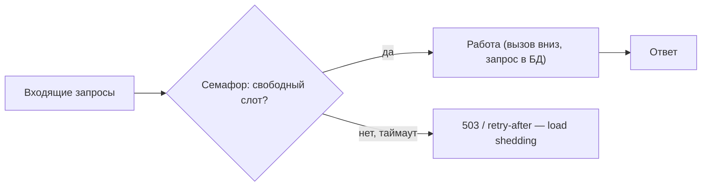
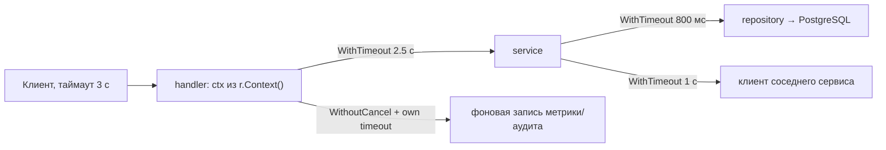
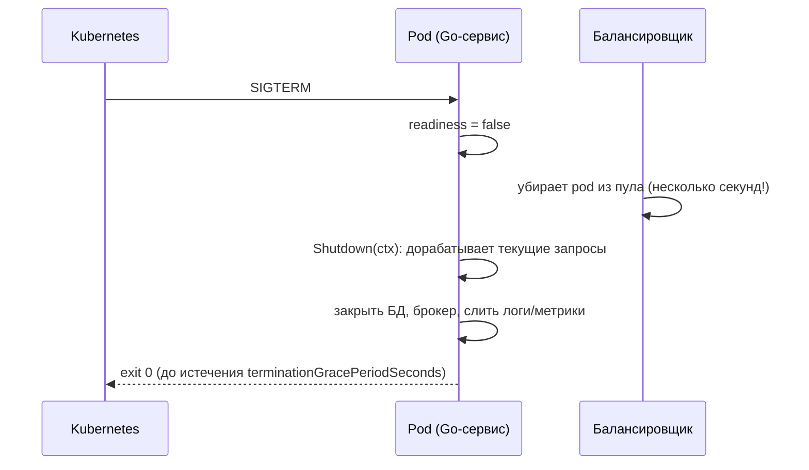

# Go под нагрузкой: параллельность, `context`, пулы, таймауты

## Простыми словами

Go делает конкурентность настолько дешёвой, что легко забыть: **дешёвая горутина не означает
бесплатный ресурс за ней**. Горутина стоит ~2 КБ стека — это ерунда. Но каждая горутина
обычно держит соединение с БД, буфер, сокет к соседнему сервису или запрос к API — и вот это
уже конечные ресурсы. Правило, вокруг которого строится весь модуль:

> Ограничивай не горутины, а **очередь к дефицитному ресурсу**. Неограниченная
> параллельность — это способ превратить «медленно» в «упало».

## Зачем ограничивать параллельность

Представь handler, который на каждый запрос запускает горутину на скачивание картинки у
соседнего сервиса. 5000 RPS × 200 мс = 1000 одновременных горутин. Вроде норм. Теперь сосед
начал отвечать за 5 секунд: 5000 × 5 = **25 000 одновременных запросов**, 25 000 сокетов,
25 000 буферов ответа по 1 МБ = 25 ГБ. Сервис умирает от OOM, хотя его собственный код
идеален. Это классический сценарий «сосед затормозил — мы упали», и он же — любимый вопрос
интервью.

Лечится **bounded concurrency**: заранее выбранным потолком одновременной работы плюс
таймаутом плюс явным отказом (load shedding), когда потолок достигнут. Отказ на входе честнее
и дешевле, чем очередь на 25 000 запросов, каждый из которых уже никому не нужен.



### Три способа ограничить, от простого к удобному

**1. Семафор на канале** — самый прозрачный:

```go
// Буферизованный канал как счётчик слотов: взял слот — работаешь, вернул — освободил.
sem := make(chan struct{}, 32) // потолок выбран из размера пула БД, а не «на глаз»

func handle(ctx context.Context, job Job) error {
    select {
    case sem <- struct{}{}:
        defer func() { <-sem }()
    case <-ctx.Done():
        return ctx.Err() // не ждём слот вечно: у запроса есть дедлайн
    }
    return process(ctx, job)
}
```

**2. Worker pool** — N горутин читают одну очередь:

```go
jobs := make(chan Job, 100) // буфер = допустимая длина очереди, а не «побольше»
for i := 0; i < 8; i++ {
    go func() {
        for j := range jobs { // выход из range при close(jobs): горутины не текут
            process(j)
        }
    }()
}
```

Пул удобен для фоновых потребителей (обработка сообщений из Kafka, отправка писем), потому
что число воркеров = число одновременных обращений к внешнему ресурсу.

**3. `errgroup` с лимитом** — то, что чаще всего показывают на интервью:

```go
g, ctx := errgroup.WithContext(ctx)
g.SetLimit(16) // одновременно не более 16 горутин; g.Go блокируется, пока не освободится слот
for _, id := range ids {
    id := id
    g.Go(func() error { return fetch(ctx, id) }) // первая ошибка отменяет ctx у остальных
}
err := g.Wait() // возвращает первую ошибку, но ждёт завершения всех
```

Что здесь стоит проговаривать вслух: `errgroup.WithContext` даёт **отмену по первой ошибке**
(остальные горутины видят `ctx.Done()` и сворачиваются), `SetLimit` даёт **потолок**, а
`Wait()` гарантирует, что после выхода из функции не осталось живых горутин — то есть нет
утечки.

### Сколько горутин — много?

Честный ответ на интервью состоит из трёх частей:

1. **Само число горутин почти не ограничение.** Сто тысяч спящих горутин — это ~200 МБ
   стеков и нормально работающий планировщик.
2. **Ограничение — ресурс за горутиной.** 100 000 горутин, каждая с соединением к БД, — это
   мертвая БД. Потолок выбирается по узкому месту: размер пула БД, лимит соседнего сервиса,
   память на буфер.
3. **Симптом «слишком много» видно в метриках**: растущий `runtime.NumGoroutine()`, растущая
   память, растущий p99 при неизменном RPS. Если число горутин монотонно растёт и не падает —
   это не нагрузка, это утечка.

## Goroutine leaks: как они убивают сервис

**Простыми словами:** утечка горутины — это горутина, которая никогда не завершится. Она
держит свою память, свои ссылки (а значит и объекты, которые GC не уберёт), иногда
соединение. Утечка не даёт мгновенного падения: сервис медленно толстеет и умирает через
шесть часов — обычно в самый неудобный момент.

Три классические причины:

```go
// 1) Отправка в канал, который никто не читает.
func leak1() {
    ch := make(chan int) // небуферизованный
    go func() { ch <- expensive() }() // если получатель ушёл по таймауту — горутина висит НАВСЕГДА
    // ... return по ошибке до чтения из ch
}

// 2) Забыли про ctx.Done() в select.
for {
    select {
    case msg := <-in:
        handle(msg)
        // нет case <-ctx.Done(): горутина не узнает об отмене и переживёт запрос
    }
}

// 3) Не закрыли тело ответа — соединение и читающая горутина остаются.
resp, _ := http.Get(url)
// defer resp.Body.Close() забыли → keep-alive соединение не переиспользуется, ресурсы висят
```

Правила, которые снимают почти все утечки:

- у каждой горутины есть **явный способ завершиться**: закрытие канала, `ctx.Done()` или
  выход по `range`;
- **тот, кто запустил горутину, отвечает за её остановку** (поэтому `errgroup.Wait()`
  и `sync.WaitGroup` — не украшение);
- отправки в канал всегда пишутся как `select { case ch <- v: case <-ctx.Done(): }`;
- `defer resp.Body.Close()` — всегда, даже если тело не нужно (тогда ещё и
  `io.Copy(io.Discard, resp.Body)`, чтобы соединение вернулось в пул);
- метрика `go_goroutines` на дашборде и алерт на её монотонный рост.

## `context`: бюджет времени, который едет по всем слоям

**Простыми словами:** `context` — это конверт, который едет вместе с запросом и в котором
лежит две вещи: «когда всё это перестанет быть нужным» (дедлайн) и «уже не нужно» (сигнал
отмены). Смысл в том, чтобы **отмена доходила до самого дна**: клиент отключился — БД
получила `cancel` и перестала жечь CPU на запрос, который никто не прочитает.



Правила, которые надо уметь произнести:

1. **`ctx` — первый параметр каждой функции, которая ходит по сети или в БД.** Не поле
   структуры, не глобальная переменная.
2. **Дедлайн ставится сверху и уменьшается вниз.** Клиенту обещано 3 секунды — значит на все
   внутренние вызовы бюджет меньше 3 секунд, с запасом на сериализацию и на повторы. Внутренний
   вызов, у которого нет дедлайна, — это будущий инцидент.
3. **Дочерний дедлайн не может быть больше родительского** (`WithTimeout` от контекста с
   дедлайном 500 мс не «продлит» до 5 с — победит ближайший дедлайн).
4. **`defer cancel()` обязателен** — иначе таймер и контекст живут до срабатывания дедлайна:
   маленькая, но настоящая утечка.
5. **`context.Value` — только для сквозных request-scoped данных** (trace id, id
   пользователя), не для передачи зависимостей и параметров.
6. **Фоновая работа, которая должна пережить запрос, — `context.WithoutCancel`.** Классика:
   пользователь получил `201 Created`, а мы дописываем аудит-лог и отправляем событие. Если
   передать туда `r.Context()`, работа отменится в момент ответа клиенту, и события будут
   исчезать «иногда» (самый противный класс баг-репортов).

```go
// Ответ уже отправлен, но аудит должен доехать: контекст без отмены, зато со своим таймаутом.
bg, cancel := context.WithTimeout(context.WithoutCancel(ctx), 5*time.Second)
go func() {
    defer cancel()
    if err := audit.Write(bg, event); err != nil {
        log.Error("audit failed", "err", err) // терять молча нельзя — это данные
    }
}()
```

Оговорка, которую ценят: горутина «в фон» без ограничений — тоже риск. В проде фоновую
работу лучше отдавать очереди/воркер-пулу с потолком (или сразу брокеру), иначе при пике
получим неограниченный fan-out.

## Пулы соединений: где живут настоящие ограничения

### `database/sql`

**Простыми словами:** `*sql.DB` — не соединение, а **пул**. Он сам открывает, переиспользует
и закрывает физические соединения. Один `*sql.DB` на процесс, создаётся в `main.go`,
передаётся дальше.

| Настройка | Что делает | Что бывает при дефолте |
|---|---|---|
| `SetMaxOpenConns(n)` | потолок одновременных соединений | по умолчанию **без лимита**: 5000 горутин = 5000 попыток соединиться, PostgreSQL с `max_connections=200` начнёт отказывать всем |
| `SetMaxIdleConns(n)` | сколько держать простаивающими | по умолчанию 2: при большом `MaxOpen` соединения постоянно открываются/закрываются, лишние TLS-хендшейки и рост latency |
| `SetConnMaxLifetime(d)` | максимальный срок жизни соединения | 0 = бесконечно: соединения не перебалансируются после failover/добавления реплики, зависают на старом хосте |
| `SetConnMaxIdleTime(d)` | закрывать давно простаивающие | 0 = держим вечно, зря занимаем слоты на сервере |

Практика: `MaxOpenConns` **маленький**, `MaxIdleConns == MaxOpenConns`, `ConnMaxLifetime`
30–60 минут (можно с небольшим разбросом, чтобы не рвать всё одновременно).

Почему пул должен быть небольшим — самая недооценённая мысль модуля. У БД конечное число CPU
и дисков. 200 одновременных запросов на 8 ядрах не выполняются «в 200 раз параллельнее» — они
дерутся за ядра, блокировки и буферы, растёт время каждого, растёт вероятность дедлоков.
Пропускная способность выходит на плато и затем **падает** (это закон универсальной
масштабируемости в бытовом изложении). Разумный старт: `MaxOpenConns` порядка нескольких
десятков на инстанс, и обязательно считаем итог: 20 pod'ов × 25 = 500 соединений, а
`max_connections` = 200 — арифметика ловит инцидент до релиза. Если суммарно нужно много —
ставят pgbouncer в режиме transaction pooling.

Важное следствие: **пул БД — естественный потолок параллельности приложения.** Если
`MaxOpenConns = 25`, запускать 500 горутин с запросами бессмысленно: 475 из них будут стоять в
очереди внутри `sql.DB`, зато потратят память и «съедят» дедлайны. Лучше ограничить наверху,
семафором того же размера, и явно отказывать при переполнении.

### `http.Transport` (исходящие HTTP)

**Простыми словами:** `http.Client` тоже переиспользует TCP-соединения (keep-alive) — но
только если ты его переиспользуешь. `http.Get` в цикле с новым клиентом на каждый вызов = новый
handshake каждый раз и куча сокетов в `TIME_WAIT`.

```go
// Один клиент на процесс. Настройки — про пул и про таймауты, а не «для красоты».
var httpClient = &http.Client{
    Timeout: 2 * time.Second, // общий потолок: DNS + connect + ответ
    Transport: &http.Transport{
        MaxIdleConns:        200,
        MaxIdleConnsPerHost: 100, // дефолт 2 (!): при нагрузке на один host соединения не переиспользуются
        MaxConnsPerHost:     200, // потолок к одному хосту = защита соседа и себя
        IdleConnTimeout:     90 * time.Second,
    },
}
```

Дефолт `MaxIdleConnsPerHost = 2` — источник загадочных «почему у нас 30 мс на каждый вызов
соседа»: соединения не кэшируются, каждый запрос делает TCP+TLS заново. Для сервиса, который
общается с одним-двумя соседями, это первое, что надо поднять.

**gRPC** устроен иначе и проще: одно соединение (HTTP/2) мультиплексирует много RPC. Значит
`grpc.ClientConn` создаётся **один раз на процесс** и переиспользуется всеми горутинами —
он потокобезопасен. Создавать соединение на запрос — самая частая ошибка новичков в gRPC:
handshake на каждый вызов и утечка соединений. Ограничение здесь — не число соединений, а
лимит одновременных стримов на соединение; при очень высоких RPS используют несколько
соединений (пул) или балансировку через `grpc.WithDefaultServiceConfig`/DNS.

## Таймауты `http.Server`: почему дефолты опасны

**Простыми словами:** у `http.Server` по умолчанию **все таймауты нулевые**, то есть
бесконечные. Клиент может открыть соединение и не отправлять ничего — соединение будет висеть,
занимая память и файловый дескриптор. Это не гипотеза, это готовая атака (Slowloris) и
обычное поведение мобильных клиентов в метро.

| Настройка | Что ограничивает | Разумно |
|---|---|---|
| `ReadHeaderTimeout` | время на получение заголовков | 5 с |
| `ReadTimeout` | чтение запроса целиком (заголовки + тело) | 10–15 с (для загрузок — больше или отдельный роутинг) |
| `WriteTimeout` | запись ответа | 10–15 с |
| `IdleTimeout` | простой keep-alive соединения | 60–120 с |
| `MaxHeaderBytes` | размер заголовков | 1 МБ или меньше |

Плюс два дополнения:

- **дедлайн на обработку** — через middleware `http.TimeoutHandler` или
  `context.WithTimeout` в handler'е: `ReadTimeout` не ограничивает время работы твоего кода;
- **лимит тела** — `http.MaxBytesReader`, иначе «загрузка файла» на 10 ГБ съест память.

## Graceful shutdown

**Простыми словами:** когда приходит SIGTERM (а в Kubernetes он приходит при каждом деплое,
то есть много раз в день), нельзя просто умереть: в полёте есть запросы, которые обслуживаются.
Graceful shutdown — «перестать принимать новое, дать доработать текущему, закрыть ресурсы».



```go
// signal.NotifyContext даёт контекст, который отменяется по SIGINT/SIGTERM.
ctx, stop := signal.NotifyContext(context.Background(), os.Interrupt, syscall.SIGTERM)
defer stop()

go func() {
    if err := srv.ListenAndServe(); err != nil && !errors.Is(err, http.ErrServerClosed) {
        log.Error("listen", "err", err)
    }
}()

<-ctx.Done() // пришёл сигнал
// Отдельный таймаут: shutdown не должен висеть дольше, чем нам даст orchestrator.
shutdownCtx, cancel := context.WithTimeout(context.Background(), 20*time.Second)
defer cancel()
if err := srv.Shutdown(shutdownCtx); err != nil {
    log.Error("graceful shutdown failed, forcing close", "err", err)
}
```

Тонкости, которые отличают сильный ответ:

- **Пауза перед `Shutdown`.** Балансировщик узнаёт о «not ready» не мгновенно; если закрыть
  листенер сразу, часть запросов получит `connection refused`. Поэтому: сначала readiness =
  false, затем 3–5 секунд сна, только потом `Shutdown`.
- **Порядок закрытия** — снаружи внутрь: HTTP-сервер → фоновые воркеры и консьюмеры → БД,
  брокер, кэш. Закроешь БД первой — запросы в полёте упадут.
- **Таймаут shutdown < `terminationGracePeriodSeconds`** (по умолчанию 30 с), иначе pod
  дострелят SIGKILL прямо посреди уборки.
- **WebSocket и долгие стримы `Shutdown` не разрывает** — их надо закрывать самому,
  иначе shutdown будет висеть до таймаута.

## Как это спрашивают на собеседовании

**«Handler должен сделать 3 независимых вызова вниз. Как запустишь?»**
Сильный ответ: «Параллельно через `errgroup.WithContext`: три `g.Go`, общий дедлайн из
`r.Context()` минус запас, первая ошибка отменяет остальные, `g.Wait()` гарантирует, что
горутин не осталось. Латентность = максимум из трёх, а не сумма. Если вызовов не три, а
триста — тот же `errgroup` с `SetLimit`, чтобы не выпустить 300 сокетов. И решаю, что делать с
частичным отказом: если один из трёх — необязательный (рекомендации), отдаю ответ без него, а
не 500».
Слабый: «запущу горутины и `sync.WaitGroup`» — без контекста, без лимита, без разговора про
частичный отказ.

**«Сколько горутин — это много?»**
Сильный: «Само число почти не важно — сто тысяч спящих горутин это ~200 МБ. Важен ресурс за
горутиной: соединения к БД, сокеты, буферы. Потолок беру от узкого места (размер пула БД или
лимит соседа) и ставлю семафор/`SetLimit`. Опасный признак — монотонный рост
`NumGoroutine` без роста RPS: это утечка, а не нагрузка».

**«Что произойдёт, если соседний сервис начнёт отвечать за 30 секунд?»**
Сильный: «Без таймаута и лимита — рост числа горутин и памяти, исчерпание пула БД (если
соединение берётся до вызова), затем OOM. Поэтому: таймаут на клиенте меньше нашего SLA,
ограниченная параллельность, circuit breaker, отказ на входе вместо бесконечной очереди. И
соединение к БД беру после сетевого вызова, а не до».

**«У `sql.DB` какие настройки поставишь?»**
Сильный: «`MaxOpenConns` порядка нескольких десятков на инстанс, `MaxIdleConns` равным
`MaxOpenConns`, `ConnMaxLifetime` 30–60 минут. И считаю сумму по всем pod'ам против
`max_connections` БД; если не сходится — pgbouncer в transaction pooling».

## Типичные ошибки и заблуждения

- **«Горутины бесплатные, лимиты не нужны».** Бесплатен стек, а не соединение, сокет и буфер
  за ней.
- **«Больше соединений к БД = быстрее».** После насыщения ядер и диска пропускная способность
  падает, а latency растёт. Пул должен быть маленьким.
- **«`http.Client` можно создавать на каждый запрос».** Тогда нет keep-alive: TCP+TLS каждый
  раз, сокеты в `TIME_WAIT`. Один клиент на процесс.
- **«gRPC-соединение на каждый вызов».** `ClientConn` потокобезопасен и мультиплексирует
  RPC: создаём один раз.
- **«`context` — это про таймауты в БД».** Это сквозной бюджет времени и отмена по всей
  цепочке, включая исходящие вызовы и фоновую работу.
- **«Передам `r.Context()` в фоновую задачу».** Она умрёт вместе с ответом клиенту. Нужен
  `context.WithoutCancel` со своим таймаутом.
- **«`defer cancel()` необязателен, контекст же соберёт GC».** Пока дедлайн не наступил,
  таймер и контекст живут: это утечка и лишняя работа.
- **«`ReadTimeout` ограничивает время работы handler'а».** Нет: он про чтение запроса. Дедлайн
  обработки ставится отдельно.
- **«Kubernetes сам всё аккуратно погасит».** Он пришлёт SIGTERM и через
  `terminationGracePeriodSeconds` — SIGKILL. Всё аккуратное — твой код.

## Глоссарий

- **Bounded concurrency** — ограниченная одновременная работа (семафор, worker pool,
  `SetLimit`); защита дефицитного ресурса.
- **Load shedding** — осознанный отказ части запросов при перегрузке вместо неограниченной очереди.
- **Goroutine leak** — горутина, которая никогда не завершится; держит память и ресурсы.
- **`errgroup`** — группа горутин с общим контекстом, отменой по первой ошибке и лимитом
  параллельности.
- **`context.WithoutCancel`** — контекст, наследующий значения, но не отмену: для работы,
  переживающей запрос.
- **Пул соединений** — набор переиспользуемых соединений; `*sql.DB` и `http.Transport` — пулы.
- **Keep-alive** — переиспользование TCP-соединения для нескольких HTTP-запросов.
- **Graceful shutdown** — прекращение приёма нового трафика с доработкой текущих запросов и
  упорядоченным закрытием ресурсов.
- **Slowloris** — атака медленными незавершёнными запросами; лечится `ReadHeaderTimeout`/`ReadTimeout`.

## См. также

- pkg.go.dev, `database/sql` (`SetMaxOpenConns`, `SetMaxIdleConns`, `SetConnMaxLifetime`):
  https://pkg.go.dev/database/sql
- pkg.go.dev, `net/http` (`Server`, `Transport`, `Shutdown`): https://pkg.go.dev/net/http
- pkg.go.dev, `context`: https://pkg.go.dev/context
- pkg.go.dev, `golang.org/x/sync/errgroup`: https://pkg.go.dev/golang.org/x/sync/errgroup
- pkg.go.dev, `os/signal` (`NotifyContext`): https://pkg.go.dev/os/signal
- Go Blog, *Go Concurrency Patterns: Context*: https://go.dev/blog/context
- gRPC docs, Performance Best Practices: https://grpc.io/docs/guides/performance/
- Nygard, *Release It!* — таймауты, bulkhead, circuit breaker (главы про stability patterns).
- Дальше: [`theory-2-runtime-and-diagnostics.md`](./theory-2-runtime-and-diagnostics.md),
  урок [`lessons/01-hardening-an-http-service.md`](./lessons/01-hardening-an-http-service.md)
