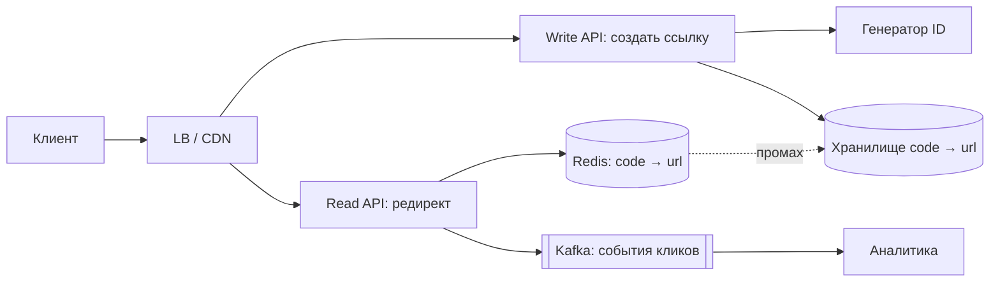
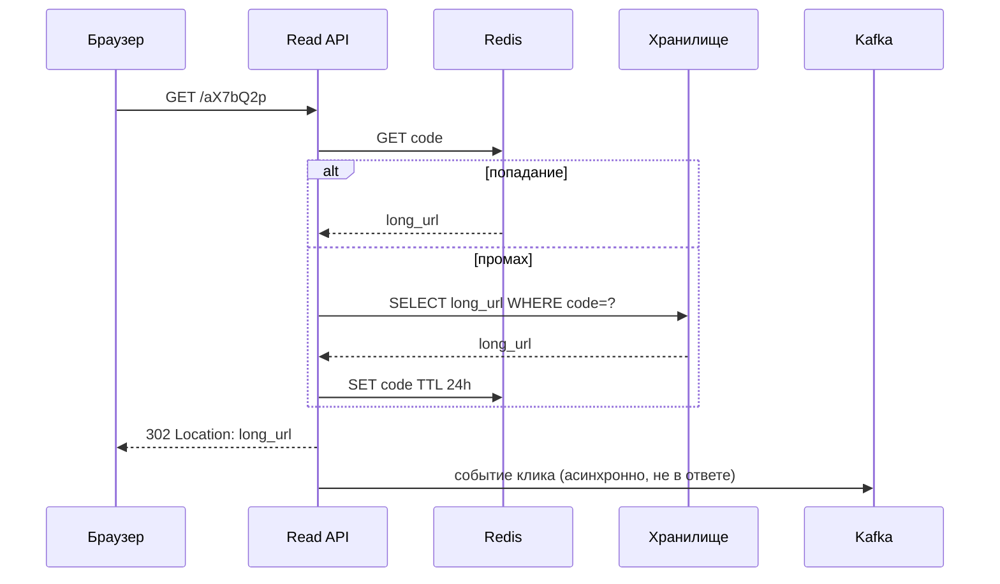

# Урок 01 — URL shortener

**Фокус задачи:** генерация коротких уникальных ID без координации между серверами + режим
редиректа (301 против 302) и его влияние на аналитику.

## 1. Требования

**Функциональные:** создать короткую ссылку из длинной; перейти по короткой на исходную;
опционально — свой алиас (`/promo2026`), срок жизни, статистика кликов.

**Нефункциональные:** редирект максимально быстрый (это единственное, что чувствует
пользователь); высокая доступность на чтение — упавший редирект ломает чужие сайты;
ссылки не должны угадываться перебором; хранение практически вечное.

**За скобками:** модерация ссылок, антифишинг, биллинг.

## 2. Оценки

- 100 млн новых ссылок в сутки → 100 000 000 / 86 400 ≈ **1150 записей/с**, пик ×3 ≈ 3500/с.
- Соотношение чтений к записям 100:1 → **115 000 редиректов/с**, пик ≈ 350 000/с. Это
  read-heavy задача, и это главное следствие оценок.
- Хранение: одна запись ≈ short_code (7 Б) + long_url (~200 Б) + user_id, время, TTL ≈ **250 Б**.
  100 млн × 250 Б = **25 ГБ/сутки** → 9 ТБ/год → за 5 лет ~45 ТБ (без учёта индексов и реплик;
  с репликацией ×3 — ~135 ТБ).
- Кэш: горячие 20% ссылок дают 80% чтений. Дневной поток уникальных ссылок в чтении оценим в
  50 млн × 250 Б ≈ 12 ГБ — помещается в Redis-кластер, значит кэш реально закрывает нагрузку.
- Длина кода: алфавит base62 (a–z, A–Z, 0–9). 62⁶ ≈ 56 млрд, 62⁷ ≈ 3.5 трлн. При 100 млн/сутки
  за 5 лет накопится 180 млрд → **7 символов**.

## 3. High-level



Разделение на запись и чтение — не формальность: у них разный профиль (3500/с против
350 000/с), разные требования к доступности и разное масштабирование.

## 4. Данные и API

```text
POST /api/v1/links        {url, alias?, ttl?}  -> {short_url}
GET  /{code}                                   -> 301/302 Location: <long_url>
GET  /api/v1/links/{code}/stats                -> {clicks, by_day, by_country}
```

Таблица `links`: `code` (PK, 7 симв.), `long_url`, `user_id`, `created_at`, `expires_at`.
Точка доступа всегда одна — по `code`, диапазонных запросов нет. Значит это идеальный
кандидат на KV-хранилище (или шардированный PostgreSQL с шардированием по хешу `code`).

## 5. Deep dive: как выдавать коды

Четыре варианта, и интервьюер ждёт сравнение.

| Подход | Как | Плюсы | Минусы |
|---|---|---|---|
| Хеш от URL (MD5/SHA → base62, первые 7) | детерминированно | одинаковый URL → один код, дедупликация | коллизии надо проверять и разрешать (retry с солью) |
| Автоинкремент БД → base62 | счётчик в одной таблице | коротко, без коллизий | единая точка записи и отказа, коды предсказуемы |
| Диапазоны (ticket server) | сервис выдаёт узлам блоки по 10 000 ID | нет координации на каждый запрос, коллизий нет | дырки в нумерации при перезапуске узла |
| Случайные 7 символов + проверка | `crypto/rand` | непредсказуемо, без координации | нужна проверка занятости при вставке |

**Рекомендация для ответа:** диапазоны (по сути Snowflake-подход из
[`../07-distributed-systems/theory.md`](../../07-distributed-systems/theory.md)) — каждый узел
берёт блок из 10 000 номеров и раздаёт локально; блок кончился — берёт следующий одним походом.
При 3500 записях/с это **один запрос к координатору раз в 3 секунды** на узел вместо 3500.

Если требуется непредсказуемость (а она обычно требуется: перебор `/aaaaaa1` вскрывает чужие
приватные ссылки) — либо случайные коды с проверкой, либо перемешивание счётчика обратимой
перестановкой перед кодированием.

```go
const alphabet = "0123456789abcdefghijklmnopqrstuvwxyzABCDEFGHIJKLMNOPQRSTUVWXYZ"

// Кодируем номер из локального диапазона: длина кода растёт логарифмически,
// поэтому 7 символов хватает до 3.5 трлн ссылок.
func encode(n uint64) string {
    if n == 0 {
        return "0"
    }
    buf := make([]byte, 0, 11)
    for n > 0 {
        buf = append(buf, alphabet[n%62])
        n /= 62
    }
    slices.Reverse(buf)
    return string(buf)
}
```

### 301 или 302 — вопрос, который задают всегда

- **301 Moved Permanently** — браузер кэширует редирект. Последующие переходы **не доходят до
  сервера**: минимальная нагрузка и минимальная задержка, но **аналитика теряется**, и
  изменить назначение ссылки практически невозможно (браузеры держат кэш долго).
- **302 Found** (или 307) — каждый переход приходит на сервер: полная аналитика, ссылку можно
  переназначить или отозвать, цена — 100% трафика на наших плечах.

Сильный ответ: «по умолчанию 302, потому что аналитика и отзыв ссылок — часть продукта; 301
имеет смысл только для вечных ссылок без статистики. И это осознанный обмен: 302 стоит нам
350 000 RPS на пике, которые закрываем кэшем с попаданием 95%+».

## 6. Путь редиректа



Ключевая деталь: событие клика **не пишется синхронно**. Аналитика не должна стоять на пути
пользователя — иначе падение аналитики уронит редиректы. Отправка в Kafka асинхронна, при её
недоступности мы теряем статистику, но не сервис.

```drill
type: free-form
prompt: "Почему событие клика не пишут синхронно в БД аналитики и что будет, если всё-таки писать?"
answer: "Редирект — самая горячая операция (сотни тысяч RPS), а аналитика не нужна пользователю в ответе. Синхронная запись добавит задержку к каждому переходу, свяжет доступность редиректа с доступностью аналитического хранилища (упала аналитика — упали все ссылки) и создаст write-heavy нагрузку на путь, который должен быть почти read-only. Правильно: отправлять событие в Kafka асинхронно и агрегировать пачками; при недоступности брокера теряем часть статистики, но не сервис. Дополнительно счётчики можно инкрементить в Redis и сбрасывать в хранилище периодически."
check: manual
```

## 7. Отказы и что спросит интервьюер

- **Redis упал.** Все чтения идут в хранилище: 350 000 RPS в БД её похоронят. Защита:
  локальный in-memory кэш на каждом узле (горячие ссылки), `singleflight` против шторма
  промахов, rate limiting и деградация.
- **Коллизия кода.** При случайной генерации — вставка с уникальным индексом и повтор при
  конфликте; вероятность мала, но обработать надо.
- **Кастомный алиас занят.** 409 Conflict; проверка через уникальный индекс, а не через
  «сначала SELECT, потом INSERT» — иначе гонка.
- **Горячая ссылка** (вирусный пост): один ключ на весь Redis-кластер. Лечится локальным кэшем
  и репликацией ключа.
- **Удаление и TTL.** `expires_at` проверяется при чтении; фоновая уборка пачками.
- **Злоупотребление**: лимит на создание ссылок по пользователю/IP, чтобы сервис не стал
  бесплатным редиректором для фишинга.

## 8. Trade-off'ы

| Решение | Плюс | Минус |
|---|---|---|
| 302 вместо 301 | аналитика, отзыв, изменение цели | вся нагрузка чтения на нас |
| Диапазоны ID | нет координации, нет коллизий | дырки в нумерации, нужен координатор |
| Случайные коды | неугадываемость | проверка занятости при вставке |
| KV вместо SQL | простое шардирование по `code` | нет сложных запросов (они и не нужны) |
| Кэш с TTL 24 ч | 95%+ попаданий | изменённая ссылка «живёт» до истечения TTL |

## Итог

Проговори про себя цепочку: read-heavy 100:1 → разделяем чтение и запись → 7 символов base62
(посчитано, а не угадано) → ID диапазонами без координации → редирект из кэша → 302 ради
аналитики и отзыва → клики асинхронно в Kafka → отказ Redis лечим локальным кэшем и
`singleflight`. Фокус задачи — **генерация ID и режим редиректа**; если в ответе есть только
схема с кэшем, разбор считается неполным.
