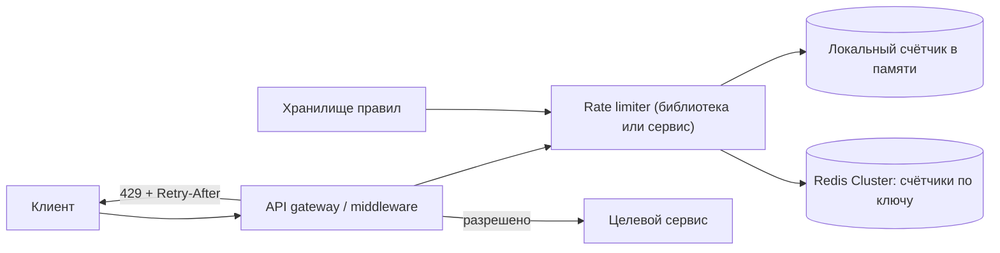
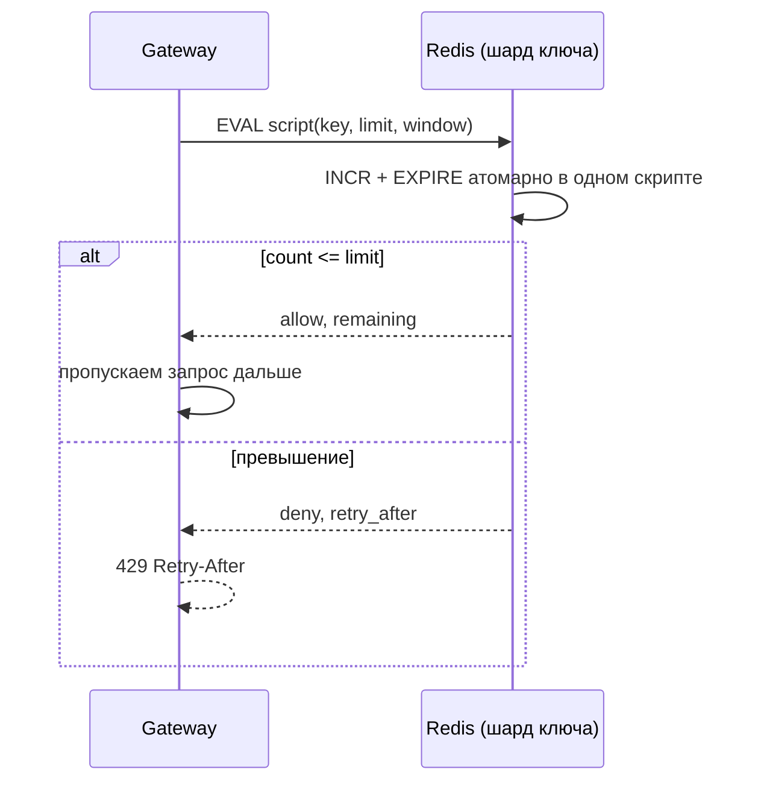

# Урок 02 — Rate limiter как сервис

**Фокус задачи:** атомарность счётчика в распределённой среде (гонки при read-modify-write) и
выбор алгоритма как обмен точности на память и латентность.

Алгоритмы сами по себе разбирались в
[`../06-scalability-and-reliability/theory.md`](../../06-scalability-and-reliability/theory.md);
здесь — как из них собрать сервис.

## 1. Требования

**Функциональные:** ограничить число запросов по ключу (пользователь, IP, API-key, эндпоинт);
поддержать разные правила («100 запросов/мин на пользователя», «10 писем/час», «1000/с на
партнёра»); вернуть отказ 429 с заголовками `X-RateLimit-Remaining` и `Retry-After`;
правила меняются без релиза.

**Нефункциональные:** задержка проверки — единицы миллисекунд (лимитер стоит **перед** каждым
запросом, значит его латентность добавляется ко всем); доступность выше, чем у защищаемого
сервиса; при отказе лимитера — **fail-open или fail-closed?** (вопрос, который надо задать
самому).

## 2. Оценки

- 1 млн RPS через шлюз, у каждого запроса 2 правила (по пользователю и по эндпоинту) →
  **2 млн проверок/с**.
- Уникальных ключей: 50 млн пользователей × 3 правила = 150 млн ключей. Один ключ в Redis
  (строка-счётчик + TTL) ≈ 100 Б → 150 млн × 100 Б = **15 ГБ**. Помещается в кластер из
  нескольких узлов; sliding window log был бы в 20–50 раз дороже — вот и первый аргумент
  против него.
- Один узел Redis тянет ~100 000 простых операций/с → 2 млн / 100 000 = **20+ узлов**
  (шардирование по ключу лимита). Значит счётчик обязан быть локальным для одного шарда — иначе
  распределённая транзакция на каждый запрос.

## 3. High-level



Первый архитектурный вопрос: **библиотека внутри gateway или отдельный сервис?** Библиотека —
на один сетевой хоп меньше (важно при 2 млн проверок/с); отдельный сервис — единая политика
для разных языков и команд, но добавляет ~1 мс к каждому запросу и становится критической
зависимостью. Честный ответ: «в gateway как библиотека, а Redis — как общее состояние».

## 4. Deep dive: атомарность

Наивная реализация:

```text
count = GET key        # 99
if count < limit: 
    SET key count+1    # два клиента прочитали 99 и оба записали 100
```

Это классическая гонка read-modify-write: при 50 параллельных запросах лимит 100 превратится в
130. Правильно — **одна атомарная операция**:

```text
INCR key              # атомарно, возвращает новое значение
EXPIRE key 60 NX      # TTL ставим только при создании ключа
```

Но и здесь есть подвох: между `INCR` и `EXPIRE` узел может упасть, и ключ останется без TTL —
навсегда. Поэтому обе команды выполняют **одним Lua-скриптом** (Redis выполняет скрипт
атомарно) или через `SET key 0 EX 60 NX` перед инкрементом.



### Выбор алгоритма

| Алгоритм | Память на ключ | Точность | Проблема |
|---|---|---|---|
| Fixed window counter | 1 число | грубая | всплеск на границе окна: 100 в конце минуты + 100 в начале = 200 за 2 секунды |
| Sliding window log | все метки времени | точная | 100 запросов = 100 записей на ключ; при 150 млн ключей неприемлемо |
| **Sliding window counter** | 2 числа | хорошая | приближение через взвешивание предыдущего окна |
| Token bucket | 2 числа (токены + время) | хорошая, разрешает всплески | нужна аккуратная арифметика при конкурентном доступе |
| Leaky bucket | 2 числа | ровный поток | не пропускает легитимные всплески |

Рекомендация: **token bucket** для API (всплески допустимы и полезны) и **sliding window
counter** там, где важна честность окна. Fixed window — только если «нам достаточно грубо и
надо очень дёшево».

## 5. Гибрид: локальный + распределённый

При 2 млн проверок/с даже 1 мс похода в Redis — это очередь. Практичное решение:

1. **Локальный лимитер на каждом узле** (`x/time/rate`) с долей общего лимита: 20 узлов,
   лимит 1000/с → по 50/с на узел. Мгновенно, без сети, но неточно при неравномерной
   балансировке.
2. **Redis — как арбитр**: узлы синхронизируют потребление раз в N миллисекунд или проверяют
   в Redis только «пограничные» ключи, близкие к лимиту.

Это и есть подход «approximate is fine»: лимит — защита от абьюза, а не бухгалтерия. Ошибка в
5% приемлема, ошибка в 500% — нет.

```drill
type: free-form
prompt: "Объясни вслух, почему GET + проверка + SET неверны для распределённого лимитера и как это исправить в Redis."
answer: "Между чтением и записью успевает вклиниться другой узел: оба прочитали 99, оба записали 100, реально пропущено 101 и больше — при высокой конкуренции превышение достигает десятков процентов. Нужна одна атомарная операция: INCR возвращает новое значение атомарно. Отдельная проблема — TTL: если узел упадёт между INCR и EXPIRE, ключ останется навсегда, поэтому инкремент и установку срока жизни выполняют одним Lua-скриптом (Redis выполняет скрипт атомарно) или через SET key 0 EX window NX перед инкрементом. Для token bucket по той же причине всю арифметику пополнения и списания токенов делают в скрипте, а не в приложении."
check: manual
```

## 6. Отказы

- **Redis недоступен.** Ключевое решение, которое надо озвучить: **fail-open** (пропускать,
  рискуя перегрузкой) или **fail-closed** (отклонять, ломая продукт). Для защиты от абьюза
  логина — fail-closed; для обычного API — fail-open с локальным лимитером как страховкой:
  «лучше грубый локальный лимит, чем никакого».
- **Горячий ключ** — один партнёр с 500 000 RPS кладёт один шард Redis. Лечится дроблением
  ключа на N подключей (`key:{0..9}`) с лимитом/N на каждый.
- **Рассинхрон часов** — при sliding window используем время Redis (`TIME`), а не время
  приложения.
- **Правила**: хранятся отдельно, кэшируются в памяти узлов с коротким TTL; отсутствующее
  правило = дефолт, а не отказ.

## 7. Что скажет клиенту

```text
429 Too Many Requests
Retry-After: 12
X-RateLimit-Limit: 100
X-RateLimit-Remaining: 0
X-RateLimit-Reset: 1757280000
```

Заголовки — не украшение: без них клиенты уходят в агрессивный retry-шторм и добивают сервис.
Плюс отдельно проговорить: клиент обязан ретраить с экспоненциальной задержкой и jitter.

```drill
type: multiple-choice
prompt: "Лимит 100 запросов в минуту, fixed window. Клиент отправляет 100 запросов в 12:00:59 и ещё 100 в 12:01:01. Что произошло?"
options: ["Всё корректно, лимит соблюдён", "Пропущено 200 запросов за 2 секунды — эффект границы окна", "Второй пакет будет отклонён", "Сработает Retry-After"]
answer: "Пропущено 200 запросов за 2 секунды — эффект границы окна"
check: exact
hint: "Именно ради этого существуют sliding window и token bucket."
```

## Итог

Цепочка ответа: считаем проверки/с и ключи → выбираем алгоритм по паре «память/точность» →
**атомарность через Lua-скрипт в Redis**, а не read-modify-write → шардируем по ключу лимита →
гибрид «локальный лимитер + Redis-арбитр» ради латентности → отдаём 429 с `Retry-After` →
явно решаем fail-open против fail-closed. Фокус — **гонка счётчика и цена точности**.
