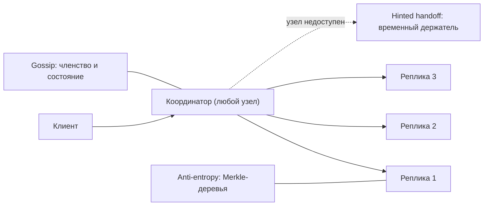
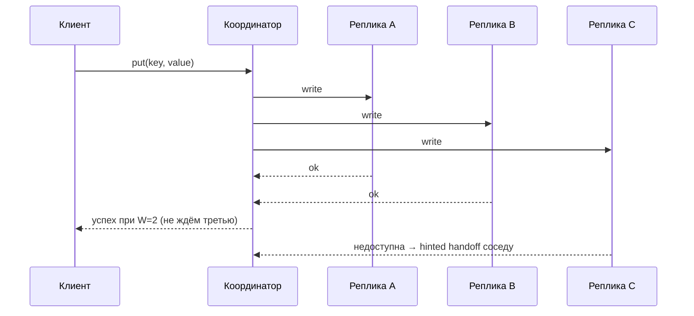

# Урок 03 — Распределённое key-value хранилище

**Фокус задачи:** как данные раскладываются по узлам (consistent hashing), как переживают
падения (репликация + кворумы R/W/N) и что делать с временно недоступным узлом (hinted
handoff) и с расхождениями (версионирование). Это задача «спроектируйте Dynamo/Cassandra».

## 1. Требования

**Функциональные:** `put(key, value)`, `get(key)`, `delete(key)`; значения до ~1 МБ; ключ —
произвольная строка. Никаких джойнов и диапазонных запросов (это упрощение, на котором всё
держится).

**Нефункциональные:** горизонтальное масштабирование добавлением узлов; **высокая доступность
на запись** (система должна принимать записи даже при отказе части узлов); настраиваемая
консистентность; латентность p99 < 10 мс; отсутствие единой точки отказа.

Сразу проговорить CAP: мы выбираем **AP** — при сетевом разделении продолжаем принимать
записи и разбираемся с расхождениями позже. Если бы требовалась строгая консистентность (CP),
это была бы другая система — с консенсусом (Raft) и потерей доступности на время выборов, см.
[`../07-distributed-systems/theory.md`](../../07-distributed-systems/theory.md).

## 2. Оценки

- 10 ТБ данных, средний объект 10 КБ → **1 млрд ключей**.
- Узел с 2 ТБ полезного диска → 10 ТБ / 2 ТБ = 5 узлов данных; с репликацией N=3 → **15 узлов**
  минимум, плюс запас на рост и на перекос → берём 20.
- 100 000 операций/с, из них 80% чтений. При N=3 каждая запись физически идёт на 3 узла →
  20 000 логических записей/с × 3 = **60 000 дисковых записей/с** — это аргумент за LSM-дерево
  (последовательная запись) вместо B-tree.
- Память под индекс/фильтры Блума: ~30 байт на ключ × 1 млрд ≈ **30 ГБ** на кластер, около
  1.5 ГБ на узел — приемлемо.

## 3. High-level



Важная черта Dynamo-подобных систем: **все узлы равноправны**, координатором становится любой
узел, получивший запрос. Нет мастера — нет единой точки отказа и нет выборов лидера на пути
запроса.

## 4. Deep dive 1: consistent hashing

**Простыми словами:** обычное `hash(key) % N` разваливается при изменении числа узлов — при
переходе с 5 узлов на 6 переезжает почти всё. Consistent hashing кладёт узлы и ключи на одно
кольцо хешей: ключ принадлежит первому узлу по часовой стрелке. Добавили узел — переезжает
только его участок, то есть примерно 1/N данных.

**Виртуальные узлы (vnodes):** один физический узел занимает 100–256 позиций на кольце. Зачем:
(1) выравнивает распределение (иначе один узел может получить втрое больше соседа),
(2) при добавлении/удалении узла нагрузка перераспределяется между **всеми**, а не между двумя
соседями, (3) позволяет учитывать разную мощность узлов — сильному даём больше vnodes.

Подробности хеширования — в [`../04-caching/theory.md`](../../04-caching/theory.md); здесь важно
уметь объяснить, **зачем** vnodes, а не только что они есть.

## 5. Deep dive 2: кворумы N/R/W

- **N** — сколько копий каждого ключа (обычно 3).
- **W** — сколько узлов должны подтвердить запись, чтобы считать её успешной.
- **R** — сколько узлов опрашивается при чтении.

Правило: если **R + W > N**, множества читающих и писавших узлов пересекаются, и чтение
гарантированно увидит последнюю подтверждённую запись.

| Конфигурация (N=3) | Свойство | Когда |
|---|---|---|
| W=2, R=2 | сильная консистентность кворума, терпит отказ 1 узла | по умолчанию |
| W=1, R=1 | максимальная скорость и доступность, eventual | метрики, кэш-подобные данные |
| W=3, R=1 | быстрое чтение, дорогая запись | read-heavy, редкие записи |
| W=1, R=3 | быстрая запись, дорогое чтение | ingest событий |



## 6. Отказы: hinted handoff и восстановление

**Hinted handoff простыми словами:** если реплика C недоступна, координатор всё равно
записывает данные — но на другой узел, с пометкой «это для C, отдай ей, когда оживёт». Когда C
возвращается, подсказки доставляются. Это и есть механизм, который позволяет системе принимать
записи при частичных отказах (та самая «высокая доступность на запись»).

**Anti-entropy (Merkle-деревья):** реплики периодически сравнивают хеш-деревья своих диапазонов.
Совпал корень — данные идентичны, обмена нет. Разошёлся — спускаемся по дереву и синхронизируем
только различающиеся куски, а не весь диапазон.

**Read repair:** при чтении координатор видит расхождение версий между репликами и в фоне
чинит отставшую.

**Конфликты записи:** два клиента записали разные значения при разделении сети. Варианты:
last-write-wins по временной метке (просто, но теряет данные и зависит от синхронности часов) или
**векторные часы**, возвращающие клиенту обе версии для слияния (как корзина покупок в Dynamo:
объединяем товары, а не выбираем одну корзину).

```drill
type: free-form
prompt: "Объясни вслух, что означает R + W > N и что даст конфигурация N=3, W=1, R=1."
answer: "N — число реплик ключа, W — сколько подтверждений нужно для успешной записи, R — сколько реплик опрашивается при чтении. Если R + W > N, читающее и писавшее множества обязательно пересекаются хотя бы в одном узле, поэтому чтение увидит последнюю подтверждённую запись — это кворумная консистентность. При N=3, W=1, R=1 сумма равна 2 и меньше 3: пересечения может не быть, чтение способно вернуть устаревшее значение. Зато и запись, и чтение максимально быстрые и переживают отказ двух узлов из трёх. Такая конфигурация уместна для данных, где свежесть не критична (счётчики просмотров, кэш-подобные значения), и неуместна там, где важна корректность. Расхождения при этом лечатся read repair и anti-entropy, а конфликты — векторными часами или last-write-wins с известными рисками."
check: manual
```

## 7. Хранение на узле

Внутри узла — **LSM-дерево**: запись идёт в WAL (для устойчивости) и в memtable в памяти;
memtable периодически сбрасывается на диск неизменяемым SSTable; фоновая компакция сливает
SSTable'ы. Почему не B-tree: LSM даёт последовательные записи и высокую пропускную способность
на запись, а мы посчитали 60 000 дисковых записей/с. Цена — усиление чтения (ключ может лежать
в нескольких SSTable), которое лечится **фильтрами Блума** (быстро отвечают «точно нет») и
компакцией.

```drill
type: multiple-choice
prompt: "Зачем в consistent hashing нужны виртуальные узлы?"
options: ["Чтобы уменьшить объём данных", "Чтобы выровнять распределение и размазать перераспределение по всем узлам при добавлении/удалении", "Чтобы ускорить хеш-функцию", "Чтобы обойтись без репликации"]
answer: "Чтобы выровнять распределение и размазать перераспределение по всем узлам при добавлении/удалении"
check: exact
```

## 8. Trade-off'ы и что спросят

- **AP вместо CP**: принимаем записи всегда, но клиент может увидеть устаревшее значение и даже
  конфликтующие версии. Если интервьюер говорит «нам нужны строгие гарантии» — это другая
  система, с Raft-группами на каждый диапазон.
- **Нет диапазонных запросов** — плата за хеш-партиционирование. Нужны — берём range-партиции и
  получаем hot spots.
- **Удаление через tombstone** (маркер), иначе удалённый ключ «воскреснет» с отставшей реплики;
  tombstone живёт дольше окна восстановления.
- **Добавление узла** — перенос ~1/N данных, throttling переноса, чтобы не убить кластер.

## Итог

Каркас ответа: **кольцо + vnodes** для размещения → **N/R/W** как ручка «консистентность против
доступности» с правилом R+W>N → **hinted handoff** для записи при отказах → **read repair и
Merkle-деревья** для схождения → **векторные часы или LWW** для конфликтов → **LSM + фильтры
Блума** внутри узла. Фокус задачи — не «какая база», а **как система остаётся доступной,
когда часть узлов недоступна**.
