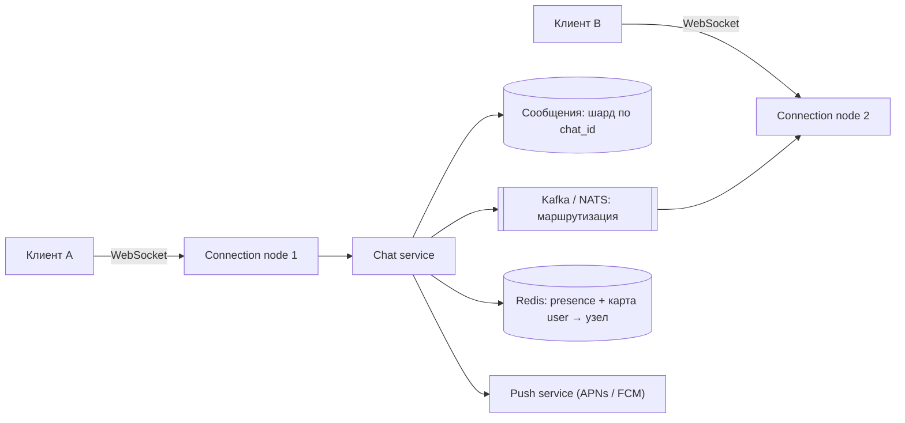

# Урок 04 — Чат / мессенджер

**Фокус задачи:** долгоживущие соединения (кто и где держит WebSocket, как найти нужный узел),
порядок и доставка сообщений, presence и fan-out в групповой чат.

## 1. Требования

**Функциональные:** личные чаты 1:1; групповые до 500 участников; доставка в реальном времени;
история сообщений; статусы «доставлено/прочитано»; онлайн-статус (presence); push для
офлайн-пользователей.

**Нефункциональные:** задержка доставки < 200 мс; **сообщения не теряются** (это главное
обещание мессенджера); порядок в пределах чата стабилен; доступность 99.99%.

**За скобками:** сквозное шифрование, звонки, медиа-обработка (упомянуть и вынести).

## 2. Оценки

- 50 млн DAU, 40 сообщений/день на пользователя → 2 млрд сообщений/сутки → 2·10⁹ / 86 400 ≈
  **23 000 сообщений/с**, пик ×3 ≈ **70 000/с**.
- Хранение: сообщение ≈ 200 Б (текст + метаданные) → 2 млрд × 200 Б = **400 ГБ/сутки** ≈
  146 ТБ/год; с репликацией ×3 — около 440 ТБ/год. Вывод: горячие данные (месяц) в быстром
  хранилище, старое — в холодное.
- Соединения: 20 млн одновременно онлайн. Один узел удерживает ~100 000 WebSocket-соединений
  (память ~10–50 КБ на соединение) → 20 млн / 100 000 = **200 узлов** соединений. Это главная
  цифра задачи: сервис соединений масштабируется отдельно от логики.

## 3. High-level



**Почему WebSocket, а не polling:** нужен двунаправленный канал с низкой задержкой; long
polling работает, но даёт лишние запросы и худшую задержку; SSE — только сервер→клиент.
Сравнение транспортов — в [`../02-networking-and-apis/theory.md`](../../02-networking-and-apis/theory.md).

## 4. Deep dive 1: как сообщение находит получателя

Ключевая трудность: A подключён к узлу 1, B — к узлу 37. Узел 1 не знает про соединение B.

```mermaid
sequenceDiagram
  participant A as Клиент A
  participant N1 as Узел 1
  participant CS as Chat service
  participant R as Redis (карта соединений)
  participant N37 as Узел 37
  participant B as Клиент B
  A->>N1: send(chat_id, text, client_msg_id)
  N1->>CS: сохранить сообщение
  CS->>CS: seq = next(chat_id); persist
  CS-->>A: ack: server_id, seq (доставлено на сервер)
  CS->>R: где B?
  R-->>CS: узел 37
  CS->>N37: push сообщение
  N37->>B: deliver
  B-->>CS: read receipt
```

Реестр соединений (`user_id → connection_node`) живёт в Redis с TTL и обновляется
heartbeat'ами. Если пользователь офлайн — сообщение остаётся в хранилище, а ему уходит push
через APNs/FCM; при подключении клиент запрашивает всё, что новее его последнего `seq`.

**Липкость соединений**: балансировщик должен уметь L4-балансировку и держать соединение на
одном узле; при падении узла клиенты переподключаются (важно: с jitter, иначе 100 000 клиентов
одновременно ударят в соседний узел — thundering herd).

## 5. Deep dive 2: порядок и доставка

Три обещания, которые надо развести:

1. **Не потерять.** Клиент считает сообщение отправленным только после `ack` от сервера с
   присвоенным `seq`. Не пришёл ack — клиент **повторяет** с тем же `client_msg_id`
   (UUID, сгенерированный на клиенте). Сервер по этому ключу дедуплицирует: это ключ
   идемпотентности, и его надо назвать по имени.
2. **Порядок.** Глобального порядка не существует и не нужен; нужен **порядок внутри чата**.
   Реализация: монотонный `seq` на `chat_id`, присваиваемый сервером (счётчик в Redis или
   в строке чата). Сортировка по времени клиента ненадёжна — часы врут.
3. **Статусы.** «Отправлено» (ack сервера) → «доставлено» (ack узла получателя) → «прочитано»
   (явное событие от клиента). Это три разных сообщения, каждое со своей ценой в трафике; в
   групповом чате «прочитано» = N событий, поэтому их батчат.

Модель хранения: партиционирование по `chat_id`, кластерный ключ `seq DESC` — тогда «последние
50 сообщений чата» читаются одним последовательным сканом. Индекс по `user_id` нужен для списка
чатов, и это отдельная денормализованная таблица `user_chats(user_id, chat_id, last_seq,
unread_count)`.

```drill
type: free-form
prompt: "Клиент отправил сообщение, но не получил ack (сеть моргнула). Он повторяет отправку. Что должно произойти на сервере и почему?"
answer: "Клиент повторяет с тем же client_msg_id — UUID, сгенерированным до первой отправки. Сервер использует его как ключ идемпотентности: уникальный индекс (chat_id, client_msg_id) или проверка в Redis. Если сообщение уже сохранено, сервер не создаёт второе, а возвращает существующие server_id и seq — клиент получит ack и снимет спиннер. Без этого ключа at-least-once доставка даёт дубликаты в чате, которые пользователь видит немедленно и считает багом. Дополнительно: seq присваивает сервер (монотонный счётчик на chat_id), потому что порядок по времени клиента ненадёжен — часы на устройствах расходятся; клиент при переподключении запрашивает всё, что новее его последнего seq, и так восстанавливает пропуски."
check: manual
```

## 6. Presence и групповой fan-out

**Presence простыми словами:** кто сейчас онлайн. Реализация: ключ в Redis с TTL 30 с,
обновляемый heartbeat'ом клиента раз в 10 с. Пропал heartbeat — ключ истёк — пользователь
офлайн. Ловушка масштаба: рассылать «X появился в сети» всем контактам — это fan-out, который
на популярном пользователе с 5000 контактов даёт шторм. Решения: рассылать только тем, у кого
открыт чат с X (подписка на presence по требованию), и агрегировать изменения пачками.

**Групповой чат:** сообщение в группу из 500 участников = 500 доставок. При 70 000 сообщений/с
и средней группе 50 человек это 3.5 млн доставок/с — вот где нужен брокер и батчинг по узлам:
одному connection-узлу отправляем одно сообщение со списком получателей, а он раскладывает
локально. Для очень больших групп (10 000+) переходят на модель «канал», где клиент **читает**
историю сам (fan-out on read), а push используется только как уведомление.

```drill
type: multiple-choice
prompt: "Почему порядок сообщений в чате определяют серверным seq на chat_id, а не временем клиента?"
options: ["Так быстрее сортировать", "Часы на устройствах расходятся, а при задержках сети сообщения приходят не в том порядке; глобальный порядок не нужен, нужен порядок внутри чата", "Чтобы экономить трафик", "Так требует WebSocket"]
answer: "Часы на устройствах расходятся, а при задержках сети сообщения приходят не в том порядке; глобальный порядок не нужен, нужен порядок внутри чата"
check: exact
```

## 7. Отказы

- **Узел соединений умер** — 100 000 клиентов переподключаются: обязателен exponential backoff
  с jitter на клиенте, иначе соседние узлы лягут по очереди (каскад).
- **Kafka лагает** — доставка в реальном времени замедляется, но сообщения сохранены: клиент
  доберёт их по `seq` при следующем запросе. Полезно: «сохранение и доставка — разные
  гарантии, теряем скорость, не данные».
- **Redis с картой соединений упал** — не знаем, куда слать: fallback на broadcast по узлам
  или деградация до «доставим при следующем pull».
- **Push-провайдер недоступен** — очередь с ретраями и TTL: устаревшее уведомление лучше не
  доставлять вовсе.

## 8. Trade-off'ы

| Решение | Плюс | Минус |
|---|---|---|
| WebSocket вместо polling | задержка и трафик | 200 узлов только под соединения, сложный деплой (соединения рвутся) |
| `seq` на чат | простой порядок и докачка | счётчик на чат — потенциальная точка конкуренции у активных групп |
| Fan-out on write в группе | мгновенная доставка | 3.5 млн доставок/с, дорого для огромных групп |
| Хранение всей истории | продуктовая ценность | 146 ТБ/год, нужен холодный слой |

## Итог

Скелет ответа: считаем соединения (это и есть масштаб) → отдельный слой connection-узлов и
реестр `user → узел` → сохранение и присвоение `seq` до доставки → ack и `client_msg_id` как
ключ идемпотентности → доставка через брокер, офлайн — push → presence через TTL-ключи с
подпиской по требованию → в группах батчинг по узлам, в огромных — переход на pull. Фокус —
**маршрутизация к соединению плюс порядок и надёжность доставки**.
