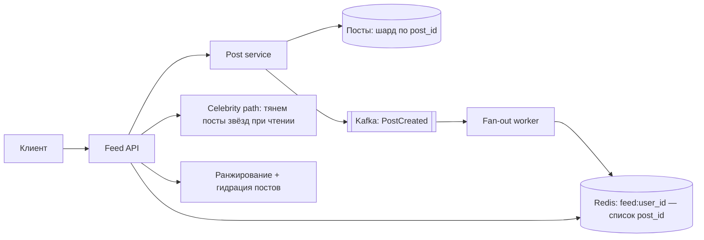
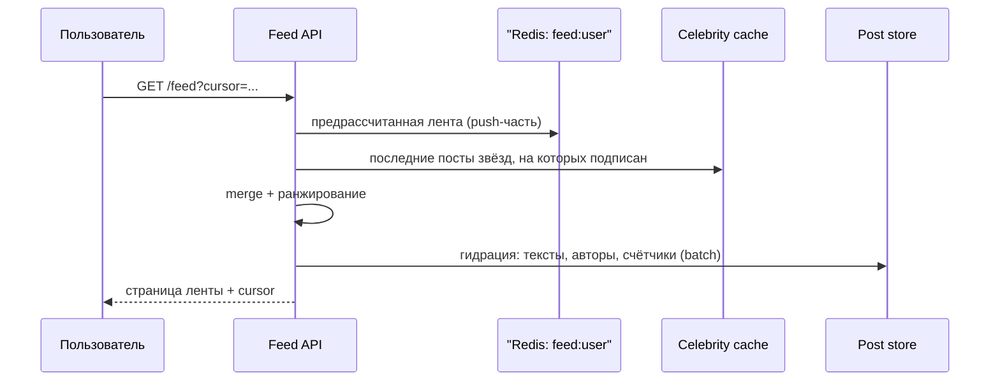

# Урок 05 — Лента новостей

**Фокус задачи:** fan-out on write против fan-out on read и **проблема знаменитости**
(celebrity problem). Всё остальное — обвязка.

## 1. Требования

**Функциональные:** опубликовать пост; посмотреть домашнюю ленту (посты тех, на кого подписан);
подписки/отписки; лайки и комментарии (счётчики); лента подгружается порциями.

**Нефункциональные:** лента открывается за < 200 мс (это главный экран, его смотрят все и
постоянно); допустима задержка появления поста у подписчиков в несколько секунд
(**eventual consistency — здесь она уместна**); автор обязан видеть свой пост сразу
(read-your-writes); read-heavy профиль.

## 2. Оценки

- 100 млн DAU; каждый открывает ленту 10 раз в день → 1 млрд чтений/сутки → 10⁹ / 86 400 ≈
  **11 500 чтений/с**, пик ×3 ≈ **35 000/с**.
- Публикаций: 10 млн постов/сутки → ≈ **116 постов/с**, пик ~350/с. Отношение чтений к
  записям ≈ **100:1** — классический read-heavy.
- Средний пользователь: 200 подписок, 200 подписчиков. Fan-out on write: 116 постов/с × 200 =
  **23 000 вставок/с** в ленты — нормально. Но у знаменитости 50 млн подписчиков: один её пост
  = **50 млн вставок**. При 1 млн вставок/с это 50 секунд работы на один пост, и всё это время
  очередь забита.
- Хранение ленты: если держим 500 записей на пользователя × 100 млн пользователей × 16 Б
  (post_id + автор + метка) = **800 ГБ** в Redis-кластере. Считаемо, но это отдельный бюджет,
  который надо назвать вслух.

## 3. High-level



## 4. Deep dive: три модели ленты

| Модель | Что происходит при публикации | Что при чтении | Когда |
|---|---|---|---|
| **Fan-out on write (push)** | пост кладётся в ленты всех подписчиков | взять готовый список — O(1) | обычные пользователи |
| **Fan-out on read (pull)** | ничего | обойти все подписки и слить по времени — O(подписок) | звёзды, редкие читатели |
| **Гибрид** | push для обычных, звёзды не разворачиваются | готовая лента + подмешивание постов звёзд | **правильный ответ** |

Почему гибрид, а не что-то одно: чистый push ломается на знаменитостях (50 млн вставок и
задержка в минуты), чистый pull ломается на обычном чтении (слить 200 источников при 35 000
RPS — это 7 млн запросов/с к постам). Гибрид платит сложностью: при чтении нужно сделать
merge двух источников и корректно применить сортировку.



Практические детали, которые ценятся:

- **В ленте хранятся только id**, а не тексты постов: 16 байт против 1 КБ, и при редактировании
  поста ничего не переписывается. Тексты подтягиваются батчем при отдаче (гидрация) — из кэша.
- **Порог знаменитости** — не абсолют, а настройка: например 100 000 подписчиков. Полезно
  сказать, что порог должен быть конфигурируемым и что решение принимается по числу подписчиков
  на момент публикации.
- **Read-your-writes**: свой свежий пост подмешивается в начало ленты на стороне API, даже если
  fan-out ещё не отработал. Без этого автор решит, что пост потерялся.
- **Обрезка**: ленту держим на 500–1000 последних записей; кто листает глубже — уходит в
  «медленный» путь с чтением из хранилища.
- **Ленивая материализация**: не разворачивать ленты для пользователей, которые не заходили
  месяц. Экономит и память, и работу воркеров.

```drill
type: free-form
prompt: "Объясни вслух проблему знаменитости и почему ответ «просто увеличим число fan-out воркеров» не проходит."
answer: "При fan-out on write публикация раскладывается по лентам всех подписчиков. У обычного пользователя это 200 вставок, у знаменитости с 50 млн подписчиков — 50 млн вставок на один пост. Это не только объём: очередь на десятки секунд занята одним постом, задерживая ленты всех остальных, а если звёзд десяток и они пишут одновременно, система стоит. Больше воркеров лишь переносит нагрузку на хранилище лент: 50 млн операций записи никуда не исчезают, и hot-shard эффект остаётся. Правильный ответ — гибрид: для авторов выше порога подписчиков fan-out не делаем вовсе, их посты читатель подмешивает при чтении из отдельного кэша «последние посты звёзд» (fan-out on read). Обычные авторы идут по push-пути. Плата — merge двух источников и более сложное ранжирование при чтении; выигрыш — публикация звезды стоит O(1)."
check: manual
```

## 5. Ранжирование

Хронология — самый простой вариант и хороший старт («сначала сделаю обратную хронологию, потом
поговорим про ранжирование»). Взвешенная лента добавляет: свежесть, силу связи с автором,
предсказанную вероятность реакции, разнообразие. Архитектурно важно другое: **ранжирование
считается на лету по ограниченному кандидату** (взяли 500 кандидатов — отранжировали 500), а
не по всему корпусу; тяжёлые ML-фичи считаются офлайн и лежат готовыми в feature store.
Для интервью достаточно назвать этот двухступенчатый шаблон: **отбор кандидатов → ранжирование**.

## 6. Кэш и счётчики

- **Кэш ленты** (Redis-список id) — основной.
- **Кэш постов** — самый горячий объект, отдельный слой; при промахе `singleflight`, чтобы
  вирусный пост не устроил шторм в БД.
- **Счётчики лайков** — не `UPDATE ... SET likes = likes + 1` в строке поста (это блокировка на
  горячей строке), а инкремент в Redis с периодическим сбросом либо отдельная таблица событий с
  агрегацией. Точное значение лайков не нужно в реальном времени — и это правильный
  trade-off для произнесения вслух.

```drill
type: multiple-choice
prompt: "Почему в предрассчитанной ленте хранят id постов, а не сами посты?"
options: ["Так требует Redis", "Экономия памяти (16 Б против ~1 КБ) и отсутствие переписывания миллионов копий при редактировании поста", "Чтобы посты нельзя было прочитать без авторизации", "Чтобы ускорить fan-out воркеры"]
answer: "Экономия памяти (16 Б против ~1 КБ) и отсутствие переписывания миллионов копий при редактировании поста"
check: exact
```

## 7. Отказы

- **Fan-out воркеры отстали** — ленты обновляются с задержкой; деградация мягкая (при чтении
  подмешиваем свежие посты подписок пачкой), паники не требуется. Обязателен алерт на лаг
  консьюмера.
- **Redis с лентами упал** — переходим на pull-режим: собираем ленту из последних постов
  подписок. Медленно, но живо; здесь спасает ограничение «первые N подписок по силе связи».
- **Удаление поста** — не бежим удалять из 50 млн лент: помечаем удалённым и фильтруем при
  гидрации.
- **Горячий пост** — вирусный контент читают все: локальный кэш на узлах API плюс CDN для медиа.

## 8. Trade-off'ы

| Решение | Плюс | Минус |
|---|---|---|
| Push для обычных | чтение O(1), простая пагинация | вставки при публикации, память под ленты |
| Pull для звёзд | публикация O(1) | merge при чтении, сложнее сортировка |
| Только id в ленте | память, простое редактирование | нужна гидрация батчем |
| Eventual consistency | дешёвая масштабируемость | пост появляется у подписчиков через секунды |

## Итог

Цепочка: read-heavy 100:1 → предрассчитанная лента из id в Redis → fan-out воркеры через Kafka
→ **звёзды исключены из fan-out и подмешиваются при чтении** → read-your-writes для автора →
обрезка и ленивая материализация → счётчики отдельно от строки поста → при отказе кэша
деградируем в pull. Фокус — **гибридный fan-out**; без него разбор ленты не засчитывается.
