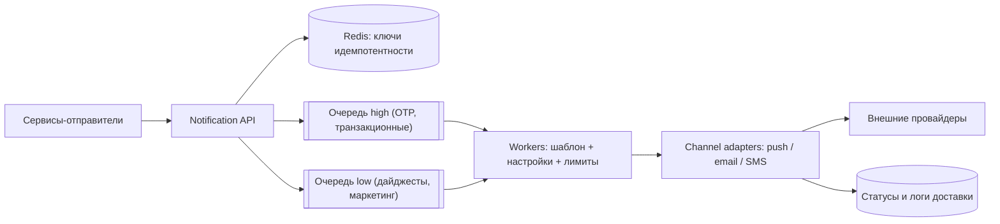
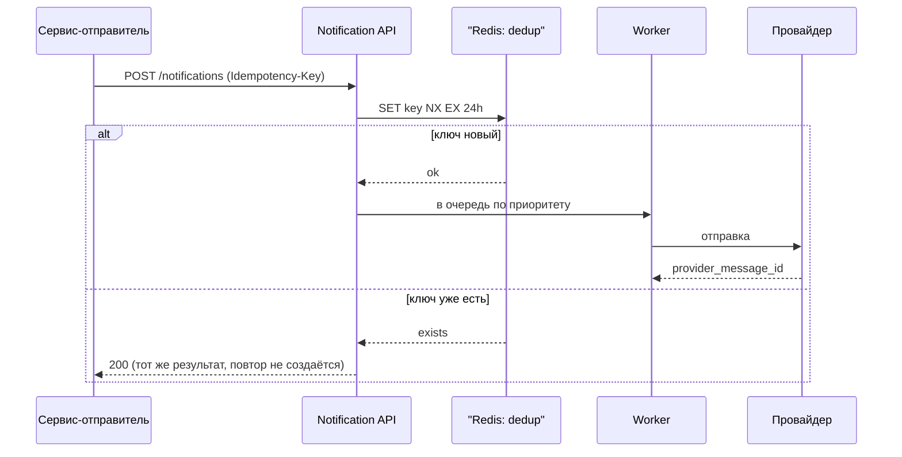

# Урок 06 — Сервис нотификаций

**Фокус задачи:** многоканальность и надёжность доставки через чужие, ненадёжные системы —
дедупликация, ретраи, приоритеты, лимиты на пользователя, шаблоны. Это задача про
**идемпотентность и хорошие манеры**, а не про хитрые алгоритмы.

## 1. Требования

**Функциональные:** отправить уведомление пользователю по каналам push (APNs/FCM), email, SMS,
in-app; шаблоны с подстановкой и локализацией; настройки пользователя (какие типы и куда);
приоритеты (OTP-код срочно, дайджест — терпит); отложенная отправка; статус доставки.

**Нефункциональные:** **не отправлять дубликаты** (два одинаковых SMS — это и раздражение, и
деньги); срочные доставляются за секунды; сервис переживает недоступность провайдера; всплески
(рассылка на 10 млн) не должны блокировать транзакционные уведомления.

## 2. Оценки

- 100 млн пользователей, в среднем 5 уведомлений/сутки → 500 млн/сутки → 500·10⁶ / 86 400 ≈
  **5800/с** в среднем.
- Пик: маркетинговая рассылка на 10 млн за 10 минут → 10⁷ / 600 = **16 700/с** только от неё,
  плюс обычный поток. Отсюда вывод: нужны **раздельные очереди по приоритетам**, иначе
  OTP-код встанет в хвост за рекламой.
- Каналы: push 70%, email 25%, SMS 5%. SMS = 25 млн/сутки; при цене условно 1 копейка за
  сообщение это ощутимые деньги — отсюда требование строгой дедупликации и лимитов.
- Хранение статусов: 500 млн записей/сутки × 100 Б = **50 ГБ/сутки**; хранить детально 30 дней
  (1.5 ТБ), дальше — агрегаты.

## 3. High-level



Ключевое архитектурное решение видно сразу: **две (или больше) независимые очереди**. Одна
очередь на всё — это гарантия, что однажды коды подтверждения будут идти по 20 минут.

## 4. Deep dive: дедупликация

Отправитель в распределённой системе почти всегда работает по at-least-once: он ретраит,
брокер доставляет повторно, воркер падает после отправки, но до коммита offset'а. Значит
дубликаты **будут**, и защита нужна на нашей стороне.



Правила, которые надо назвать:

- **Ключ идемпотентности задаёт отправитель** и он должен быть детерминированным:
  `order-123:status-shipped:user-42`, а не случайный UUID на каждую попытку. Случайный UUID
  защищает от повтора одного и того же запроса, но не от «двух сервисов решили сообщить об одном
  событии».
- **Окно дедупликации** — часы или сутки, в зависимости от типа. Хранится в Redis, а для
  важных каналов дублируется уникальным индексом в БД (Redis может потерять ключи при
  failover — и это надо признать вслух).
- **Дедупликация на уровне контента** — вторая линия: «одному пользователю не больше одного
  уведомления этого типа в час».

## 5. Ретраи и провайдеры

Внешние провайдеры падают, отвечают 500 и режут по квоте. Политика:

| Ответ провайдера | Действие |
|---|---|
| 5xx, таймаут | ретрай с экспоненциальной задержкой и jitter, до 5 попыток |
| 429 (квота) | уважать `Retry-After`, притормозить весь канал (backpressure) |
| 4xx (невалидный токен, отписка) | **не ретраить**, пометить адрес/токен недействительным |
| Успех | сохранить `provider_message_id` для сверки статусов |

Дополнительно: **DLQ** для окончательно неудачных, чтобы разбирать руками; **circuit breaker**
на провайдера, чтобы не тратить воркеров на заведомо мёртвый канал; **fallback-канал** (push не
дошёл за 5 минут → SMS) — но только для тех типов, где это оправдано, иначе счёт за SMS
удивит финансовый отдел.

Ещё одна тонкость: **exactly-once с внешним провайдером недостижим**. Если мы отправили запрос
и не получили ответ — мы не знаем, ушло сообщение или нет. Выбор осознанный: для OTP лучше
повторить (риск двух SMS), для маркетинга — лучше пропустить. Формулировка «выбираем сторону
ошибки по типу уведомления» звучит очень зрело.

```drill
type: free-form
prompt: "Воркер отправил SMS провайдеру, но упал до записи статуса. После перезапуска сообщение снова в очереди. Как не отправить второе SMS?"
answer: "Полностью исключить дубликат нельзя: между отправкой и подтверждением есть окно, и провайдер — внешняя система. Что делаем: 1) перед отправкой атомарно занимаем ключ идемпотентности (SET key NX EX окно) и пишем строку в БД со статусом sending — повторная обработка того же события увидит занятый ключ и не отправит; 2) передаём провайдеру собственный идемпотентный ключ, если он это поддерживает — тогда дубль отсекается на его стороне; 3) при неоднозначном исходе сверяем статус по provider_message_id или по журналу провайдера перед повторной отправкой; 4) осознанно выбираем сторону ошибки: для OTP лучше отправить второй раз, чем не отправить вовсе, для маркетинга — наоборот, пропустить. И отдельно ограничиваем частоту по пользователю, чтобы любой сбой не превратился в шквал сообщений."
check: manual
```

## 6. Шаблоны, настройки и лимиты

- **Шаблоны** версионируются и хранятся отдельно от кода (иначе каждая правка текста — релиз);
  рендеринг с экранированием (HTML в письме — это XSS-вектор), локализация по языку
  пользователя, обязательная валидация переменных при сохранении шаблона.
- **Настройки пользователя** — матрица «тип уведомления × канал», плюс глобальные отписки.
  Проверка настроек — **до** постановки в очередь и ещё раз перед отправкой (пользователь мог
  отписаться, пока сообщение лежало в очереди).
- **Тихие часы**: не будить пользователя в 3 ночи по его локальному времени — значит нужен его
  часовой пояс и планировщик отложенной отправки.
- **Лимиты на пользователя**: не больше N уведомлений в час — та самая защита из урока про rate
  limiter, только применённая к исходящему потоку.

```drill
type: multiple-choice
prompt: "Почему транзакционные уведомления (OTP) и маркетинговые рассылки разводят по разным очередям?"
options: ["Ради красоты схемы", "Рассылка на 10 млн займёт очередь на десятки минут, и код подтверждения придёт слишком поздно", "Разные форматы сообщений", "Так дешевле хранить"]
answer: "Рассылка на 10 млн займёт очередь на десятки минут, и код подтверждения придёт слишком поздно"
check: exact
hint: "Изоляция классов трафика — это bulkhead."
```

## 7. Отказы

- **Провайдер лежит** — circuit breaker, накопление в очереди, TTL на сообщение (уведомление
  «ваш заказ подъезжает», доставленное через 3 часа, вреднее, чем недоставленное).
- **Очередь растёт** — алерт на лаг консьюмера; при переполнении отбрасываем низкоприоритетные
  (осознанный load shedding), а не всё подряд.
- **Redis с ключами дедупликации потерял данные** — включается вторая линия: уникальный индекс
  в БД и лимит частоты по пользователю.
- **Массовая рассылка сгенерирована ошибочно** — нужен «стоп-кран»: возможность отменить
  запланированную кампанию и глобальный лимит отправок в минуту.

## 8. Trade-off'ы

| Решение | Плюс | Минус |
|---|---|---|
| Приоритетные очереди | OTP не ждёт маркетинг | больше движущихся частей, нужен контроль обеих |
| Дедуп в Redis | быстро и дёшево | возможна потеря ключей при failover — нужна вторая линия |
| Fallback push → SMS | доставляемость | деньги и риск дублей |
| TTL на уведомление | не доставляем неактуальное | часть уведомлений теряется молча — нужны метрики |

## Итог

Каркас: API с ключом идемпотентности → раздельные очереди по приоритетам → воркеры,
проверяющие настройки, тихие часы и лимиты → адаптеры каналов с ретраями, backoff, DLQ и
circuit breaker → статусы и метрики доставляемости. Фокус — **дедупликация и вежливость к
пользователю**; сильный ответ обязательно проговаривает, что exactly-once с внешним провайдером
недостижим и что сторона ошибки выбирается по типу уведомления.
