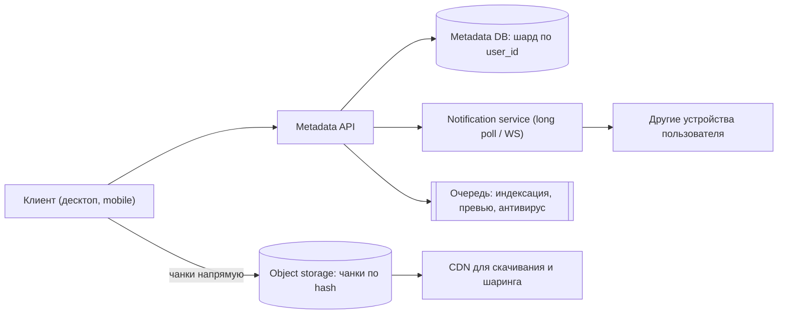
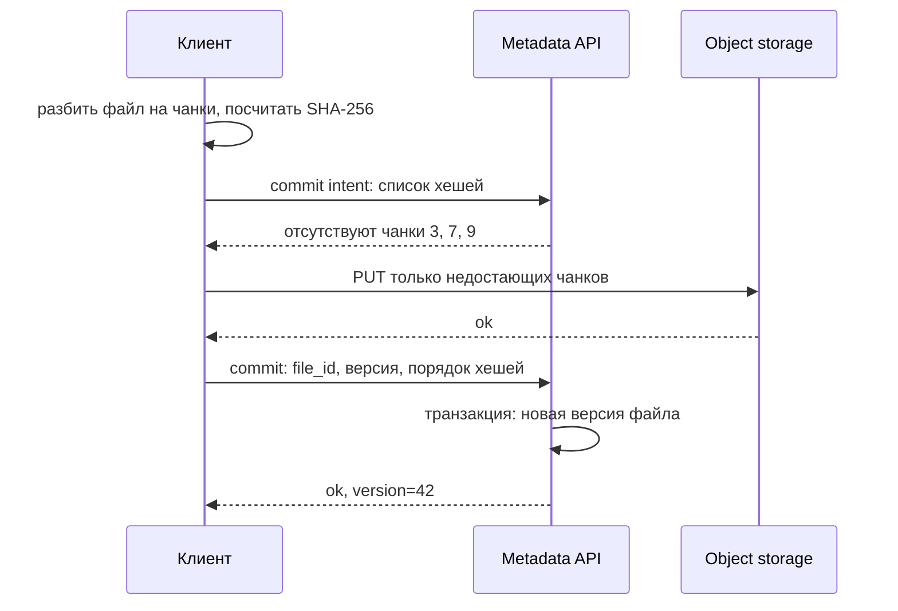

# Урок 07 — Файловое хранилище (Dropbox)

**Фокус задачи:** разделение метаданных и содержимого, **чанкинг** (загружать и синхронизировать
куски, а не файлы целиком), дедупликация по хешу и разрешение конфликтов при синхронизации с
нескольких устройств.

## 1. Требования

**Функциональные:** загрузить/скачать файл; синхронизация папки между устройствами;
история версий; шаринг ссылкой; работа офлайн с догоном изменений.

**Нефункциональные:** надёжность данных превыше всего (потерянный файл — конец продукта);
экономия трафика при изменении большого файла; загрузка переживает обрыв связи (докачка);
задержка синхронизации — секунды.

## 2. Оценки

- 50 млн пользователей, 10 млн активных в сутки; в среднем 2 загрузки/сутки по 10 МБ →
  20 млн × 10 МБ = **200 ТБ/сутки** входящего трафика; 200 ТБ / 86 400 с ≈ **2.3 ГБ/с**.
- Хранение: 50 млн × 10 ГБ квоты, реально занято ~10% → **50 ПБ**. С репликацией/erasure coding
  ×1.4–3 → до 150 ПБ. Это территория объектного хранилища (S3-подобное), не БД.
- Метаданные: 50 млн пользователей × 5000 файлов = **250 млрд записей**? Нет — считаем честно:
  реалистично 50 млн × 2000 = 100 млрд записей о файлах и чанках, по 200 Б = **20 ТБ
  метаданных**. Значит метабаза шардируется по `user_id`.
- Дедупликация: по опыту индустрии значительная часть контента повторяется (одинаковые
  документы, установщики). Экономия хранилища — прямая финансовая величина, отсюда важность
  content-addressable хранения.

## 3. High-level



Главное разделение, которое надо произнести первым: **метаданные и содержимое живут отдельно**.
Метаданные — маленькие, транзакционные, требуют консистентности (PostgreSQL/шардированный SQL).
Содержимое — большое, неизменяемое, требует дешёвого объёма (объектное хранилище). Смешивать их
в одной БД — самая частая ошибка в этой задаче.

## 4. Deep dive 1: чанкинг и дедупликация

**Простыми словами:** файл режется на куски фиксированного размера (например 4 МБ). Каждый кусок
хешируется (SHA-256) и хранится под именем-хешем. Файл в метаданных — это упорядоченный список
хешей.

Что это даёт:

- **Докачка**: оборвалась связь на 700 МБ из 1 ГБ — доливаем только оставшиеся чанки.
- **Дельта-синхронизация**: изменили 1 МБ в 1-гигабайтном файле — заново заливается один чанк
  (4 МБ), а не гигабайт. Экономия трафика в сотни раз.
- **Дедупликация**: если чанк с таким хешем уже есть — не загружаем вообще (клиент сначала
  спрашивает «какие из этих хешей у вас есть?»). Одинаковые файлы у миллиона пользователей
  хранятся один раз.
- **Параллельная загрузка**: чанки грузятся в несколько потоков.



Тонкости для сильного ответа: фиксированные чанки просты, но вставка байта в начало файла
сдвигает всё и делает дельту бесполезной — от этого спасает **content-defined chunking**
(границы чанков определяются по содержимому, скользящим хешем). Для интервью достаточно знать,
что такая проблема есть и как называется решение. Дедупликация «между пользователями» требует
внимания к приватности и к подтверждению владения (нельзя позволить скачать чужой файл, просто
угадав его хеш).

## 5. Deep dive 2: синхронизация и конфликты

Клиент держит локальный журнал и **курсор** — позицию в потоке изменений своего аккаунта.
Сервер хранит журнал изменений (`user_id`, `seq`, операция). Клиент спрашивает: «что нового
после seq=1042?» — через long polling или WebSocket. Push-уведомление говорит «есть изменения»,
а сам клиент забирает дельту — так проще и надёжнее.

**Конфликт**: два устройства офлайн изменили один файл. Варианты разрешения:

| Стратегия | Поведение | Где уместно |
|---|---|---|
| Last-write-wins | побеждает последняя запись | опасно: молча теряет работу пользователя |
| **Конфликтная копия** | сохраняем обе версии: `doc (conflicted copy from laptop).md` | стандарт для файловых хранилищ |
| Слияние | автоматическое объединение | только для известных форматов (текст, структурированные данные) |
| Блокировка файла | заранее запрещаем параллельное редактирование | корпоративные сценарии |

Правильный ответ — **конфликтная копия**: пользователь всегда предпочтёт лишний файл потерянным
данным. Реализация: оптимистичная блокировка по версии. Клиент присылает «я меняю версию 41» —
если на сервере уже 42, это конфликт, и создаётся вторая ветка.

```drill
type: free-form
prompt: "Объясни вслух, зачем в файловом хранилище чанкинг, и посчитай экономию при правке 1 МБ в файле 1 ГБ."
answer: "Файл режется на чанки (например по 4 МБ), каждый адресуется своим SHA-256, а файл в метаданных — упорядоченный список хешей. При правке 1 МБ внутри гигабайтного файла меняется один-два чанка: заливается 4–8 МБ вместо 1024 МБ, экономия трафика примерно в 130–250 раз, и столько же по времени загрузки. Дополнительно чанкинг даёт докачку после обрыва (не начинаем сначала), параллельную загрузку в несколько потоков и дедупликацию: перед загрузкой клиент спрашивает, какие хеши уже есть на сервере, и одинаковый контент хранится один раз для всех пользователей. Ограничение фиксированных чанков — вставка байта в начало файла сдвигает все границы и делает дельту бесполезной; лечится content-defined chunking, где границы определяются по содержимому. При дедупликации между пользователями нужно проверять владение, иначе знание хеша даст доступ к чужому файлу."
check: manual
```

## 6. Метаданные и API

```text
POST /files/commit-intent   {path, size, chunk_hashes[]}  -> {missing_hashes[]}
PUT  /chunks/{hash}                                        -> 200
POST /files/commit          {path, chunk_hashes[], base_version} -> {file_id, version}
GET  /delta?cursor=1042                                    -> {changes[], cursor}
GET  /files/{id}/download                                  -> presigned URL (CDN)
```

Таблицы: `files(file_id, user_id, path, current_version)`, `file_versions(file_id, version,
chunk_list, size, created_at)`, `chunks(hash, size, refcount)`. Шардирование по `user_id` —
все запросы пользователя попадают в один шард, что позволяет держать транзакцию при коммите
версии.

**Скачивание не должно идти через наш API**: сервер выдаёт presigned URL, клиент забирает
данные напрямую из объектного хранилища/CDN. Иначе 2.3 ГБ/с трафика поедет через наши серверы
без всякой пользы.

```drill
type: multiple-choice
prompt: "Два устройства офлайн изменили один и тот же файл. Что делает файловое хранилище в норме?"
options: ["Last-write-wins: сохраняет последнюю версию", "Создаёт конфликтную копию и сохраняет обе версии", "Отклоняет обе записи", "Сливает файлы побайтово"]
answer: "Создаёт конфликтную копию и сохраняет обе версии"
check: exact
hint: "Пользователь простит лишний файл, но не простит потерянную работу."
```

## 7. Отказы и надёжность

- **Потеря данных недопустима** — репликация в нескольких зонах или erasure coding
  (например 10 данных + 4 контроля: переживаем потерю 4 фрагментов при накладных расходах 40%
  вместо 200% у тройной репликации).
- **Обрыв загрузки** — чанки уже загружены и остаются валидными; коммит версии атомарен, то
  есть частично загруженный файл не появляется у пользователя.
- **Сборка мусора**: чанк удаляется, только когда `refcount` дошёл до нуля и прошёл период
  отсрочки (иначе гонка между удалением и новой ссылкой).
- **Metadata DB недоступна** — скачивание уже выданных ссылок работает, загрузка встаёт: важно
  проговорить, что деградация частичная, а не полная.
- **Шифрование**: at rest в хранилище, in transit по TLS; ключи — в менеджере секретов.

## 8. Trade-off'ы

| Решение | Плюс | Минус |
|---|---|---|
| Метаданные отдельно от блобов | каждый компонент по своей задаче | две системы, нужна согласованность (коммит после загрузки) |
| Чанки по 4 МБ | дельта, докачка, дедуп | больше записей в метаданных, накладные на мелкие файлы |
| Дедупликация глобальная | экономия хранилища | приватность и проверка владения |
| Конфликтная копия | ничего не теряется | пользователь видит «мусорные» файлы |
| Erasure coding | дешевле тройной репликации | дороже по CPU и медленнее восстановление |

## Итог

Порядок ответа: разделить метаданные и содержимое → чанкинг с адресацией по хешу → протокол
«спроси недостающие чанки → залей → закоммить версию» → журнал изменений с курсором для
синхронизации → конфликты через версии и конфликтные копии → скачивание мимо API через presigned
URL и CDN → надёжность через репликацию/erasure coding и refcount при удалении. Фокус —
**чанкинг, дедупликация и конфликты синхронизации**.
