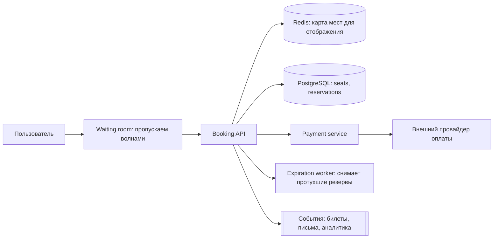
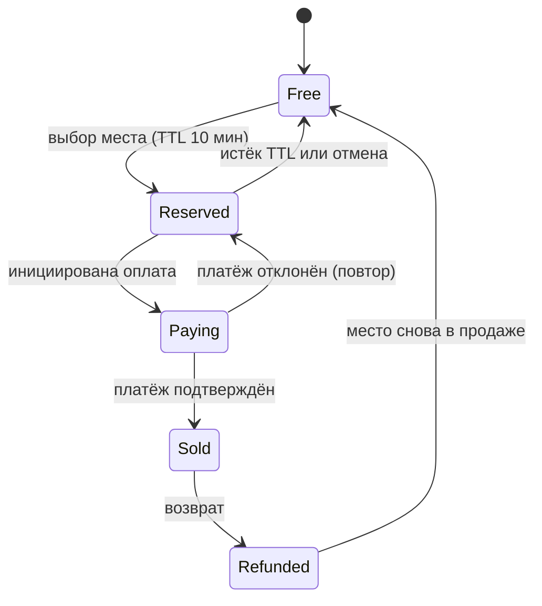
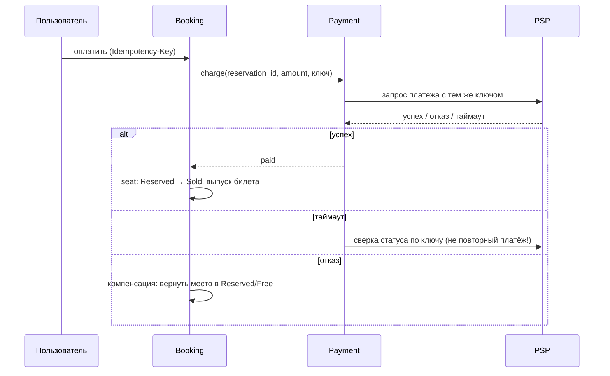

# Урок 08 — Бронирование билетов и инвентарь

**Фокус задачи:** двойное бронирование. Всё остальное — обвязка вокруг одного вопроса: как в
условиях конкуренции гарантировать, что место продано ровно один раз, и при этом не заморозить
систему.

## 1. Требования

**Функциональные:** посмотреть события и свободные места; выбрать место и **зарезервировать**
его на время оплаты; оплатить и получить билет; отменить бронь; вернуть место в продажу по
истечении резерва.

**Нефункциональные:** **никакого двойного бронирования** — это единственное место, где нужна
строгая консистентность; поиск и просмотр — быстрые и допускают устаревшие данные на секунды;
всплеск нагрузки при старте продаж на популярное событие (×1000 к обычному); оплата
идемпотентна.

Важная формулировка для интервью: «чтение мест — eventual consistency, захват места — строгая.
Смешивать эти требования не нужно, и именно поэтому система выживает».

## 2. Оценки

- 10 000 событий, по 20 000 мест → 200 млн мест — данные небольшие, поместятся в один
  шардированный SQL-кластер. **Объём здесь не проблема, проблема — конкуренция.**
- Обычный день: 1 млн просмотров/ч → ~280 RPS чтения, брони — 10 000/ч ≈ 3/с. Спокойно.
- Старт продаж на стадион: 100 000 человек ломятся за 50 000 мест в первые 60 секунд →
  **1600 попыток брони/с**, а с ретраями и обновлениями страницы — десятки тысяч RPS. Всё это
  бьёт **в одно событие**, то есть в один шард и в одни и те же строки. Классический hot spot.
- Вывод из оценок: нужны очередь ожидания (waiting room), кэш карты мест и очень короткие
  транзакции.

## 3. High-level



**Waiting room** — приём, который стоит назвать: пускаем в систему фиксированное число
пользователей в секунду, остальным показываем очередь с номером. Это не костыль, а форма
load shedding: 100 000 одновременных попыток гарантированно положат БД, а честная очередь
сохраняет и систему, и нервы.

## 4. Deep dive: как не продать место дважды

Три подхода — и интервьюер ждёт сравнение, а не выбор наугад.

### Вариант A. Пессимистичная блокировка (`SELECT ... FOR UPDATE`)

```sql
BEGIN;
SELECT status FROM seats
 WHERE event_id = $1 AND seat_id = $2 AND status = 'free'
   FOR UPDATE;                 -- строка заблокирована до конца транзакции
UPDATE seats SET status='reserved', reserved_until = now() + interval '10 minutes',
       reservation_id = $3
 WHERE event_id = $1 AND seat_id = $2;
COMMIT;                        -- транзакция короткая: никакой сети и оплаты внутри!
```

Гарантия абсолютная. Цена: конкурирующие транзакции **ждут** на строке. Правило, которое надо
произнести: **внутри транзакции нельзя ходить в платёжный провайдер** — иначе блокировка
держится секунды, соединения из пула заканчиваются, и весь сервис встаёт (см.
[`../09-go-in-system-design/theory.md`](../../09-go-in-system-design/theory.md)).

### Вариант B. Оптимистичная блокировка (version / условный UPDATE)

```sql
UPDATE seats SET status='reserved', version = version + 1, reservation_id = $3
 WHERE event_id=$1 AND seat_id=$2 AND status='free' AND version=$4;
-- rows affected = 0 → место уже занято, отдаём 409 и предлагаем соседнее
```

Никто никого не ждёт: проигравший просто получает 0 изменённых строк. Лучше при высокой
конкуренции **на разные места** и при коротких операциях; хуже, когда все дерутся за одно
место (много бесполезных повторов).

### Вариант C. Резерв в Redis

Атомарный `SET seat:{event}:{seat} {user} NX EX 600` — быстро и снимает нагрузку с БД, но
Redis не является источником истины: при failover ключи могут потеряться. Годится как
«фильтр первой ступени» перед БД, а не как единственная гарантия.

**Рекомендация:** пессимистичная блокировка на очень короткой транзакции (это самый защищаемый
ответ для денег и мест) либо условный `UPDATE ... WHERE status='free'` — по сути та же
атомарность в одном стейтменте. Redis — как ускоритель отображения и как предварительный
отсев.

## 5. Резерв с TTL и жизненный цикл места



Резерв обязан **истекать сам**: пользователь закрыл вкладку — место не должно висеть вечно.
Реализация: колонка `reserved_until` + фоновый воркер, который пачками освобождает просроченное.
Важная деталь: воркер не единственная защита — при попытке брони проверяем
`status='free' OR reserved_until < now()`, поэтому даже отставший воркер не блокирует продажу.

## 6. Оплата: идемпотентность и saga

Оплата — внешний вызов, значит нас ждёт неопределённость: ответ мог потеряться, а деньги
списаться.



Что здесь надо назвать словами:

- **Ключ идемпотентности** формируется из `reservation_id` и передаётся и нам, и провайдеру:
  повтор запроса не создаёт второй платёж.
- **Saga вместо распределённой транзакции**: шаги «резерв → платёж → выпуск билета» с
  компенсациями (отменить резерв, сделать возврат). 2PC через внешнего провайдера невозможен —
  он не участник нашей транзакции.
- **Outbox** для событий: «билет продан» записывается в ту же транзакцию, что и статус места, и
  публикуется отдельным процессом. Иначе классика: место продано, а письмо не ушло (или
  наоборот).
- **Сверка (reconciliation)** — ночной процесс, сравнивающий наши платежи с выпиской
  провайдера. Ни одна распределённая система не обходится без сверки, и упоминание этого сильно
  добавляет веса ответу.

```drill
type: free-form
prompt: "Спроектируй вслух защиту от двойного бронирования и объясни, почему нельзя держать транзакцию открытой во время оплаты."
answer: "Захват места делаю одной короткой транзакцией: SELECT ... FOR UPDATE по строке места с проверкой status='free' OR reserved_until < now(), затем UPDATE в reserved с reserved_until = now() + 10 минут и commit. Эквивалент — условный UPDATE ... WHERE status='free', где нулевое число изменённых строк означает, что место уже занято, и мы отдаём 409. Оптимистичная схема с version лучше, когда конкуренция размазана по разным местам; пессимистичная — когда дерутся за одно. Redis-резерв через SET NX EX годится как быстрый предварительный отсев, но не как источник истины: при failover ключи теряются. Держать транзакцию открытой во время оплаты нельзя, потому что платёж — внешний вызов на секунды: блокировка строки и соединение из пула удерживаются всё это время, при 1600 попытках в секунду пул мгновенно исчерпывается и встаёт весь сервис, а не только продажи. Поэтому оплата идёт после коммита резерва, в отдельном шаге saga, с ключом идемпотентности и компенсацией при отказе, а резерв истекает по TTL, если пользователь не завершил оплату."
check: manual
```

## 7. Отказы

- **Платёж прошёл, наш сервис упал до записи** — спасает идемпотентный ключ и сверка: при
  восстановлении запрашиваем статус по ключу и достраиваем состояние.
- **Redis упал** — карта мест отображается из БД (медленнее), брони не страдают, потому что
  истина в БД.
- **Всплеск старта продаж** — waiting room, кэш карты мест с коротким TTL, запрет тяжёлых
  запросов на время пика, отдельный пул соединений для операций брони (bulkhead), чтобы
  просмотры не съедали ресурс у покупок.
- **Горячий шард** (одно событие) — шардируем по `event_id`, но популярное событие всё равно
  одно; спасают короткие транзакции, очередь на вход и разбиение мест на секторы для
  параллельной обработки.
- **Возвраты и перепродажа** — место возвращается в `Free` только после подтверждённого
  возврата денег, иначе продадим место, за которое ещё не вернули деньги.

## 8. Trade-off'ы

| Решение | Плюс | Минус |
|---|---|---|
| `FOR UPDATE` | железная гарантия | ожидание на строке, требует очень коротких транзакций |
| Оптимистичная блокировка | нет ожиданий | повторы при высокой конкуренции за один объект |
| Резерв с TTL | не теряем места из-за брошенных корзин | пользователь может «не успеть» и потерять место |
| Saga вместо 2PC | работает с внешним провайдером | нужны компенсации и сверка |
| Waiting room | система выживает в пик | пользователю приходится ждать |

## Итог

Формула ответа: **чтение — eventual, захват — строгая консистентность**; короткая транзакция с
`FOR UPDATE` или условным `UPDATE`; резерв с TTL и самоочисткой; оплата вне транзакции, с ключом
идемпотентности; saga с компенсациями и outbox для событий; waiting room и bulkhead на пиках;
ночная сверка с провайдером. Фокус — **двойное бронирование и удержание блокировки во время
внешнего вызова**; сильный кандидат называет обе ловушки сам.
