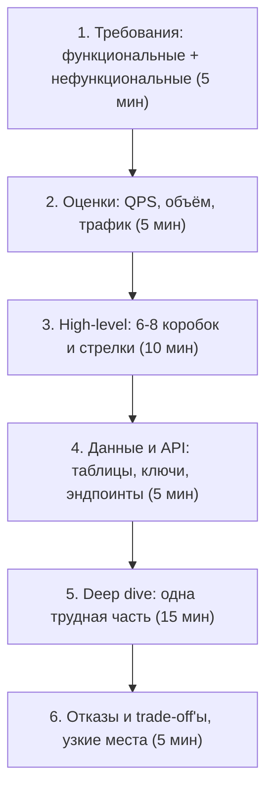

# Как решать любую задачу: каркас, решающие правила, фокусы

## Простыми словами

Задач на собеседовании бесконечно много, а **ходов** — десятка полтора. Кэш, реплика, шард,
очередь, индекс, денормализация, идемпотентный ключ, блокировка, TTL. Хороший кандидат
отличается не тем, что знает больше ходов, а тем, что **выбирает ход по признаку задачи** и
объясняет цену. Этот текст — про признаки и цены.

## Каркас на любой задаче

Каркас из модуля 01 ([`../01-interview-framework-and-estimation/theory.md`](../01-interview-framework-and-estimation/theory.md))
в применении к разбору, с бюджетом времени на 45 минут:

Три правила, которые дороже любой схемы:

1. **Не начинай с решения.** Первые пять минут — вопросы. Сколько пользователей, чтений
   против записей, какая консистентность допустима, нужен ли глобальный охват, что можно
   потерять при аварии.
2. **Считай вслух и с единицами.** «100 млн DAU × 10 действий / 86 400 с ≈ 12 000 RPS,
   пиковый ×3 ≈ 35 000». Округляй: 86 400 → 100 000, если удобнее. Никто не проверяет
   арифметику до третьего знака, но все проверяют, есть ли она вообще.
3. **Называй trade-off раньше, чем спросят.** «Беру денормализацию — быстрее чтение, дороже
   запись и риск рассинхрона; лечу фоновым пересчётом».

## Решающий cheat-sheet

### Read-heavy или write-heavy?

Первый вопрос после требований, потому что он определяет половину архитектуры.

| Признак | Read-heavy (соотношение 10:1 и выше) | Write-heavy |
|---|---|---|
| Примеры | лента, каталог, короткие ссылки | метрики, логи, лайки, ingest событий |
| Главный ход | кэш + реплики чтения + денормализация | буфер/очередь + батчинг + LSM-хранилище |
| Узкое место | попадания в кэш, hot keys | скорость записи на диск, WAL, лаг репликации |
| Типичное хранилище | PostgreSQL + Redis, CDN | Kafka → колоночное/временное хранилище, Cassandra |
| Что скажет интервьюер | «а если ключ горячий?» | «а если писателей стало ×10?» |

### Fan-out на запись или на чтение?

**Простыми словами:** когда одно событие должно попасть многим (пост → подписчикам,
сообщение → участникам чата), есть два момента, где можно сделать работу: **при записи**
(разложить по всем получателям сразу) или **при чтении** (собрать на лету).

| | Fan-out on write (push) | Fan-out on read (pull) |
|---|---|---|
| Работа при записи | O(число получателей) | O(1) |
| Работа при чтении | O(1), готовый список | O(число источников) — собрать и слить |
| Когда | получателей мало, чтений много | получателей огромное количество (селебрити) |
| Риск | «звезда» с 50 млн подписчиков кладёт запись | медленное чтение и сложная сортировка |
| Ответ на интервью | **гибрид**: push для обычных, pull для звёзд | |

### Когда шардировать

Не «когда много данных», а когда выполняется хотя бы одно:
- данные не помещаются на один узел (диск или память);
- запись упирается в один узел (реплики чтения уже не помогают);
- нужна изоляция по клиенту/региону (multi-tenant, требования по локализации данных).

Цена шардирования, которую надо назвать: пропадают межшардовые джойны и транзакции,
появляется проблема выбора ключа и **hot shard**, решардинг становится проектом.
Ключ выбирают так, чтобы (1) он был в большинстве запросов, (2) распределение было ровным,
(3) связанные данные лежали вместе. Детали — в
[`../03-databases-replication-sharding/theory.md`](../03-databases-replication-sharding/theory.md).

### Когда кэшировать

Кэш оправдан, если: чтений сильно больше записей, данные терпят устаревание на T секунд,
есть выраженные горячие ключи. Кэш **не лечит** плохой запрос и неверный индекс — сначала
профиль и `EXPLAIN`, потом Redis. Обязательные вопросы к любому кэшу: TTL, стратегия
инвалидации, что при промахе-шторме (`singleflight`, probabilistic early expiration), что при
падении Redis (сервис обязан работать медленнее, но работать). См.
[`../04-caching/theory.md`](../04-caching/theory.md).

### Когда очередь

Ставь очередь, если работа: не нужна в ответе клиенту (письма, индексация, аналитика),
всплесковая (сглаживание пиков), долгая (транскодинг), или требует ретраев с DLQ. Цена:
eventual consistency, дубликаты при at-least-once (нужен ключ идемпотентности), новая
инфраструктура и отдельный класс инцидентов «консьюмер отстал на 4 часа». См.
[`../05-queues-and-async/theory.md`](../05-queues-and-async/theory.md).

### Три вопроса про консистентность

1. Что видит пользователь **сразу после своей записи**? (read-your-writes — почти всегда
   обязателен: человек должен видеть свой пост.)
2. Что видят **другие** и через сколько? (секунда — нормально почти везде, кроме денег и
   инвентаря.)
3. Где нужна **строгая** гарантия? Обычно ровно одно место: списание денег, бронь места,
   уникальность. Туда — транзакции и блокировки, всё остальное — eventual.

## Восемь задач и их фокусы

Фокус — та единственная трудность, ради которой задачу и спрашивают. Если в ответе фокус не
прозвучал, разбор считается поверхностным, даже если схема нарисована красиво.

| Задача | Профиль | Фокус (ради чего спрашивают) |
|---|---|---|
| URL shortener | read-heavy, 100:1 | генерация коротких уникальных ID без координации; редирект 301 vs 302 и его влияние на аналитику |
| Rate limiter | write-heavy счётчики | атомарность счётчика в распределённой среде; выбор алгоритма и точность vs память |
| Key-value store | зависит | партиционирование consistent hashing, кворумы R/W/N, отказы и hinted handoff |
| Чат / мессенджер | write-heavy, real-time | доставка и порядок сообщений, presence, WebSocket-соединения и маршрутизация к нужному узлу |
| Лента новостей | read-heavy | fan-out on write vs read и проблема знаменитости; ранжирование и кэш ленты |
| Нотификации | всплесковая | дедупликация, ретраи, приоритеты, лимиты на пользователя, шаблоны и каналы |
| Файловое хранилище | большие объекты | чанкинг, дедупликация, метаданные отдельно от блобов, синхронизация и конфликты |
| Бронирование билетов | конкурентная запись | двойное бронирование: блокировки vs оптимистичность, резерв с TTL, идемпотентная оплата и saga |

## Как это спрашивают на собеседовании

**«Спроектируйте Twitter».** Формулировка нарочно широкая. Сильный ответ начинается с
сужения: «Twitter — это много подсистем. Предлагаю сосредоточиться на публикации твитов и
домашней ленте, а поиск, рекламу и рекомендации вынести за скобки — если останется время,
вернёмся». Это не увиливание, а управление рамкой.

**«Сколько это будет стоить по железу?»** Проверяют, доводишь ли оценки до конца: объём в
день × срок хранения → терабайты → число узлов при N ТБ на узел + репликация ×3.

**«Что сломается первым при росте в 10 раз?»** Любимый вопрос. Сильный ответ называет
конкретное место (запись в одну таблицу, один горячий ключ, fan-out звезды) и план
(шардирование по ключу X, гибридный fan-out, батчинг).

**«Ты выбрал Redis/Kafka/Cassandra — почему?»** Отвечать через свойство, а не через бренд:
«мне нужен атомарный инкремент с TTL и субмиллисекундная латентность — это Redis; альтернатива
— счётчики в PostgreSQL, но там на порядок дороже запись».

## Типичные ошибки и заблуждения

- **Сразу рисовать схему.** Без требований и оценок схема — угадайка. Пять минут вопросов
  окупаются весь оставшийся час.
- **Числа «на глаз».** «Ну, там много запросов». Много — это сколько, в каких единицах и в
  пике?
- **Перечислять технологии вместо свойств.** «Возьмём Kafka» без ответа на «зачем и что
  сломается без неё».
- **Пропускать фокус.** Разбор чата без разговора про порядок и доставку сообщений; лента без
  проблемы знаменитости; бронирование без двойного бронирования.
- **Забывать про отказы.** Каждая коробка на схеме должна получить вопрос «а если она
  умерла/тормозит?».
- **Проектировать под 100 млн DAU, когда спросили про 10 тысяч.** Оверинжиниринг — тоже
  ошибка дизайна, и её замечают.
- **Молчать.** Интервьюер оценивает ход мысли; тишина не оценивается никак.

## Глоссарий

- **Фокус задачи** — центральная трудность, ради которой задачу задают.
- **Fan-out on write / on read** — разложить событие получателям при записи / собрать при чтении.
- **Hot key / hot shard** — ключ или шард, на который приходится непропорциональная доля нагрузки.
- **Read-your-writes** — гарантия, что автор сразу видит собственную запись.
- **Ключ идемпотентности** — идентификатор операции, позволяющий безопасно повторить запрос.
- **Резерв с TTL** — временная блокировка ресурса (места, товара), которая сама истекает.
- **Деградация** — сознательный отказ от части функциональности ради выживания основной.

## См. также

- Alex Xu, *System Design Interview: An Insider's Guide*, vol. 1 (2020) и vol. 2 (2022) —
  разборы именно этих задач; bytebytego.com.
- Kleppmann, *Designing Data-Intensive Applications* (2017) — гл. 5–6 (репликация,
  партиционирование), гл. 7 (транзакции), гл. 9 (согласованность и консенсус).
- Google SRE book: https://sre.google/books/
- DeCandia et al., *Dynamo: Amazon's Highly Available Key-value Store* (SOSP 2007) — база для
  урока про KV-хранилище.
- microservices.io — saga, outbox, идемпотентность: https://microservices.io/patterns/index.html
- Уроки модуля: от [`lessons/01-url-shortener.md`](./lessons/01-url-shortener.md)
  до [`lessons/08-ticket-booking.md`](./lessons/08-ticket-booking.md).
